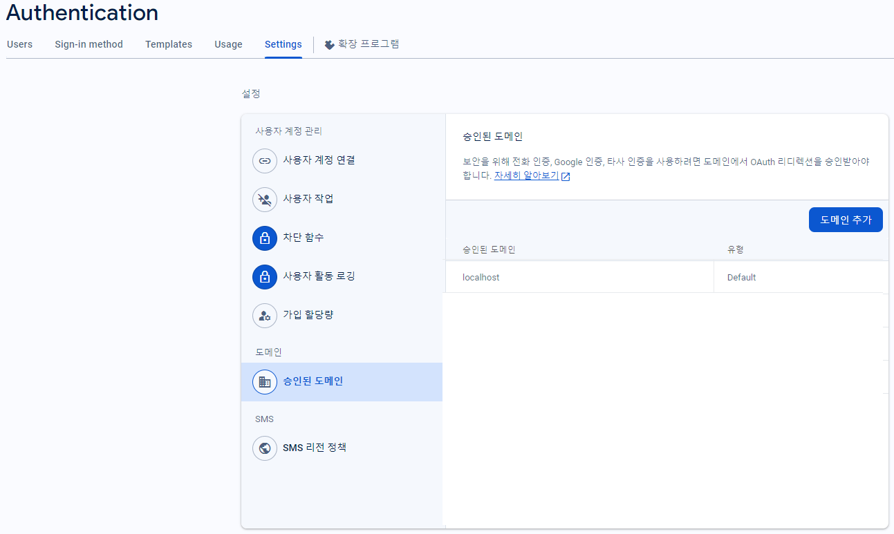
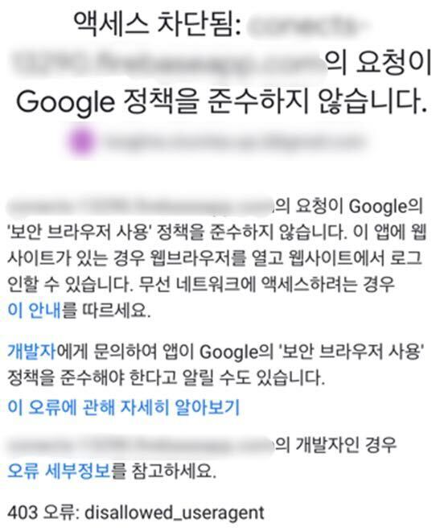

+++
title = "[WebView] 웹뷰에서 제한되는 구글 OAuth, 네이티브로 처리하기"
date = "2024-01-11"
draft = false
tags = ["WebView", "OAuth", "Google", "JavaScript"]
+++

앱 내 웹뷰에서 구글 로그인을 연동하는 과정에서, 브라우저에서는 정상적으로 동작하던 OAuth 인증이 웹뷰 환경에서는 제대로 처리되지 않는 문제를 확인했다.

원인을 확인해보니 구글이 보안상의 이유로 웹뷰에서의 OAuth 사용을 제한하고 있기 때문이었다. 구글 블로그에서도 웹뷰 환경에서의 OAuth 요청을 더 이상 허용하지 않는다고 안내하고 있다.

> **향후 몇 개월 내에 저희는 “웹 뷰”라고 하는 임베디드 브라우저에서 구글에 대한 OAuth 요청을 더 이상 허용하지 않을 것입니다.**  
<span style="font-size:0.9rem; color:#666666;">
    출처: <a href="https://developers-kr.googleblog.com/2016/08/modernizing-oauth-interactions-in-native-apps.html"
    style="color:#666666;">Google for Developers 국문 블로그 - 더 나은 사용성과 보안을 위해 웹뷰에서의 OAuth 사용 제한</a>
</span>

그래서 이후에는 현재 구조 안에서 적용할 수 있는 방법들을 기준으로 로그인 처리 방식을 하나씩 시도해보았다.

#### 웹뷰 User Agent 설정
가장 먼저 시도한 방법은 웹뷰 호출 시 `User Agent` 정보를 설정하는 것이었다. 하지만 Android에서는 로그인이 가능했던 반면, iOS에서는 여전히 제한되고 있었다. 플랫폼에 따라 동작 여부가 달라지는 방식은 근본적인 해결 방안으로 삼기 어려웠다.

#### Firebase JavaScript SDK
다음으로는 `Firebase JavaScript SDK`를 이용해 로그인을 시도하는 것이었다. 관련 코드는 아래 공식 문서를 참고했다.



<span style="font-size:0.9rem; color:#666666;">
    참고: <a href="https://firebase.google.com/docs/auth/web/google-signin?hl=ko"
    style="color:#666666;">자바스크립트로 Google을 사용하여 인증</a>
</span>

```javascript
import { getAuth, GoogleAuthProvider, signInWithPopup } from "firebase/auth";

const auth = getAuth();
const provider = new GoogleAuthProvider();

signInWithPopup(auth, provider)
    .then((result) => {
        const credential = GoogleAuthProvider.credentialFromResult(result);
        const token = credential.accessToken;
        // 이후 로그인 처리
    });
```
먼저 Firebase Console의 승인된 도메인 설정에 웹뷰에서 접근하는 서버 도메인을 등록한 뒤, 서버 페이지에서 `Firebase JavaScript SDK`의 `SignInWithPopup()`을 호출해 구글 로그인 화면에 접근하도록 구성했다.



실제 웹뷰 환경에서 테스트한 결과, 여전히 구글 로그인에 정상적으로 접근할 수 없었고 `403: disallowed_useragent` 오류가 발생했다.

결국 `Firebase JavaScript SDK`를 사용하더라도 웹뷰 내부에서 OAuth를 처리하는 구조는 그대로였기 때문에, 이 방식 역시 해결 방법이 되지는 못했다.

#### 앱과 웹뷰 인터페이스로 로그인 처리하기
마지막으로 시도한 방법은 구글 로그인 자체는 네이티브에서 처리하고, 웹뷰에서는 로그인 결과만 전달받아 후속 처리를 이어가는 방식이었다.


<small style="display:block; text-align:center; color:#666666;">Firebase SDK Android File</small>

<small style="display:block; text-align:center; color:#666666;">Firebase SDK iOS File</small>

먼저 각 플랫폼의 Firebase 설정 파일을 네이티브 환경에 적용하여 구글 로그인 화면을 웹뷰가 아닌 네이티브 영역에서 호출할 수 있도록 구성했다.

```javascript
<script>
    document.getElementById('google-signin').addEventListener('click', () => {
        if (deviceType === 'android') {
            window.AppBridge?.postMessage(JSON.stringify({ action: 'GOOGLE' }));
            return;
        }

        window.webkit?.messageHandlers?.AppBridge?.postMessage({
            action: 'GOOGLE'
        });
    });
</script>
```
웹뷰에서 구글 로그인 버튼이 클릭되면 플랫폼에 맞는 네이티브 인터페이스로 약속된 액션을 전달하고, 로그인 성공 후에는 전달받은 토큰 값을 기반으로 서버에서 후속 로그인 처리를 진행하도록 구성했다.

웹뷰 환경에서 외부 인증을 처리하기 어려운 경우에는, 웹뷰 내부에서만 해결하려 하기보다 네이티브 영역과 연동하는 방향이 더 적절할 수 있다는 점을 확인할 수 있었다.