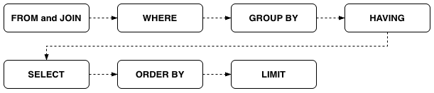
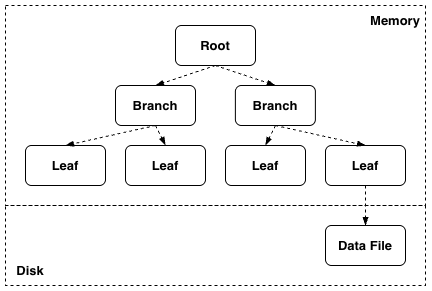
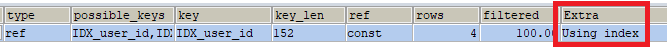
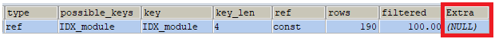
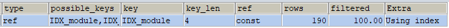
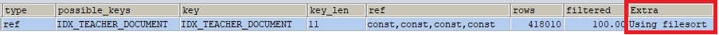
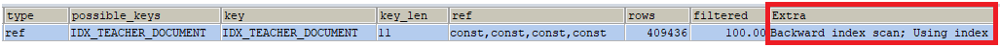

+++
title = "[MySQL] 커버링 인덱스(Covering Index)로 쿼리 성능 개선하기"
date = "2025-07-20"
draft = false
tags = ["MySQL"]
+++

#### 커버링 인덱스 적용 이유

쿼리 수행 시간이 오래 걸리는 경우, 성능을 개선할 수 있는 방법 중 하나로 커버링 인덱스(Covering Index)라는 걸 알게 되었다. 이번 글에서는 이 개념을 예시와 함께 정리해보려고 한다.

#### 커버링 인덱스(Covering Index)



커버링 인덱스란 쿼리를 충족시키는 데 필요한 모든 데이터를 갖고 있는 인덱스를 말한다. `WHERE` 절에 대한 인덱스뿐만 아니라 `SELECT`, `ORDER BY`, `GROUP BY` 등에 사용되는 모든 컬럼이 인덱스의 구성 요소가 되는 것이다. 이를 잘 활용하면 해당 컬럼을 읽기 위해 실제 데이터 블록(디스크 저장소)까지 접근할 필요가 없어서 쿼리 성능을 향상시킬 수 있다.

#### Clustered Index와 Non-Clustered Index의 탐색 과정

| 구분 | 설명 |
|------|------|
| Clustered Index | DB 테이블당 1개만 존재할 수 있다. PK를 설정하면 자동으로 생성된다. |
| Non-Clustered Index | DB 테이블당 여러 개 생성할 수 있다. Unique 제약 조건을 설정하면 자동으로 생성된다. |

MySQL의 InnoDB 스토리지 엔진에서는 Non-Clustered Index에 Clustered Index가 항상 포함되어 있다. Non-Clustered Index가 아닌 Clustered Index만이 실제 데이터 블록의 위치를 알고 있기 때문이다. 즉, 인덱스에 포함된 컬럼이 `WHERE` 절에 있더라도, 포함되지 않은 컬럼이 `SELECT` 절에 있다면 Non-Clustered Index 안에 있는 Clustered Index를 통해 실제 데이터 블록까지 접근해서 찾아야 한다.



인덱스는 B-tree(InnoDB 스토리지 엔진의 경우 B+tree) 자료구조를 사용한다. 간단히 말하면 Root → Branch → Leaf 노드 순으로 탐색하고, Leaf 노드에 있는 실제 데이터 포인터 위치를 통해 디스크에 저장된 데이터 파일에 접근한다. 디스크에서 읽는 것은 메모리에서 읽는 것보다 훨씬 성능이 낮기 때문에, 쿼리 처리에 필요한 모든 컬럼을 가진 커버링 인덱스를 사용하면 실제 데이터 블록에 접근할 필요가 없어져서 디스크 접근 비용을 줄이고 성능을 높일 수 있다.



커버링 인덱스가 적용됐는지는 실행 계획(`EXPLAIN`)의 Extra 필드에서 확인할 수 있는데, 커버링 인덱스가 적용된 경우 `Using index`가 표시된다.

#### SELECT 절

먼저 모든 컬럼을 조회하는 쿼리를 실행해보았다.

```sql
SELECT * FROM DOCUMENT WHERE module_id = 1;
```



```sql
-> Index lookup on DOCUMENT using IDX_module (module_id=1)  (cost=137.12 rows=190) (actual time=0.032..0.798 rows=190 loops=1)
```

`IDX_module`이라는 인덱스가 `WHERE` 절에 사용되었지만, Extra 필드는 빈 값으로 나온다. `SELECT` 절에서 테이블의 모든 컬럼을 조회하기 위해 실제 데이터 블록에 접근했다는 뜻이다.

이번에는 인덱스에 포함된 컬럼만 조회해보았다.

```sql
SELECT module_id FROM DOCUMENT WHERE module_id = 1;
```



```sql
-> Covering index lookup on DOCUMENT using IDX_module (module_id=1)  (cost=19.45 rows=190) (actual time=0.029..0.076 rows=190 loops=1)
```

`SELECT` 절에서 인덱스에 해당하는 컬럼만 조회하니, Extra 필드에 `Using index`가 나온다. 인덱스 컬럼만으로 쿼리가 전부 처리된 경우이며, 커버링 인덱스가 사용됐다는 뜻이다.

#### GROUP BY 절

`GROUP BY` 절에 대한 인덱스 적용 조건은 인덱스가 `INDEX(a, b, c)`로 구성되어 있다고 할 때 다음과 같다.

| 구분 | 조건 |
|------|------|
| 적용되는 경우 | 명시된 `GROUP BY` 순서와 인덱스 컬럼 순서가 같으면 적용된다. (`GROUP BY a, b, c`) 순서가 같은 상태에서 뒤에 있는 컬럼이 생략되어도 적용된다. (`GROUP BY a`, `GROUP BY a, b`) |
| 적용되지 않는 경우 | 명시된 순서와 인덱스 컬럼 순서가 다르면 적용되지 않는다. (`GROUP BY a, c, b`) 순서가 같아도 앞에 있는 컬럼이 생략되면 적용되지 않는다. (`GROUP BY b, c`) 인덱스에 없는 컬럼이 포함되어 있으면 적용되지 않는다. (`GROUP BY a, b, c, d`) |

`WHERE` 절과 `GROUP BY` 절을 함께 사용할 경우에는 다음과 같은 조건이 추가된다. (인덱스는 마찬가지로 `INDEX(a, b, c)`)

| WHERE 절 조건 | 설명 |
|------|------|
| 동등 비교 | `GROUP BY` 절에 명시되지 않은 컬럼이 있어도 적용된다. (`WHERE a = 1 GROUP BY b, c`, `WHERE a = 1 AND b = "b" GROUP BY c`) |
| 범위 비교 | `LIKE` 사용 시 와일드카드(`%`)를 문자열 앞에 넣으면 인덱스가 적용되지 않으므로 뒤에 넣어야 한다. (`WHERE a = 1 AND b = "%b" GROUP BY c`는 적용 안 됨, `WHERE a = 1 AND b = "b%" GROUP BY c`는 적용됨) |

범위 비교 조건에서는 실행 계획의 Extra 필드를 확인해서 임시 테이블(`Using temporary`)이나 테이블 정렬(`Using filesort`) 같은 항목이 나오지 않는지 확인해야 한다.

#### ORDER BY 절

`ORDER BY` 절에 대한 인덱스 적용 조건은 `GROUP BY` 절과 비슷하다. (인덱스는 마찬가지로 `INDEX(a, b, c)`)

| 구분 | 조건 |
|------|------|
| 적용되는 경우 | 명시된 `ORDER BY` 순서와 인덱스 컬럼 순서가 같으면 적용된다. (`ORDER BY a, b, c`) 순서가 같은 상태에서 뒤에 있는 컬럼이 생략되어도 적용된다. (`ORDER BY a`, `ORDER BY a, b`) |
| 적용되지 않는 경우 | 명시된 순서와 인덱스 컬럼 순서가 다르면 적용되지 않는다. (`ORDER BY a, c, b`) 순서가 같아도 앞에 있는 컬럼이 생략되면 적용되지 않는다. (`ORDER BY b, c`) 인덱스에 없는 컬럼이 포함되어 있으면 적용되지 않는다. (`ORDER BY a, b, c, d`) 정렬 순서(오름차순/내림차순)가 컬럼마다 다르면 적용되지 않는다. (`ORDER BY a, b DESC, c`) |

`WHERE` 절과 `ORDER BY` 절을 함께 사용할 경우에도 `GROUP BY`와 같은 조건이 적용된다. (인덱스는 마찬가지로 `INDEX(a, b, c)`)

| WHERE 절 조건 | 설명 |
|------|------|
| 동등 비교 | `ORDER BY` 절에 명시되지 않은 컬럼이 있어도 적용된다. (`WHERE a = 1 ORDER BY b, c`, `WHERE a = 1 AND b = "b" ORDER BY c`) |
| 범위 비교 | `LIKE` 사용 시 와일드카드(`%`)를 문자열 앞에 넣으면 인덱스가 적용되지 않으므로 뒤에 넣어야 한다. (`WHERE a = 1 AND b = "%b" ORDER BY c`는 적용 안 됨, `WHERE a = 1 AND b = "b%" ORDER BY c`는 적용됨) 마찬가지로 실행 계획의 Extra 필드에서 `Using temporary`나 `Using filesort`가 나오지 않는지 확인해야 한다. |

이렇게 `ORDER BY` 절의 정렬 순서에 따라 인덱스 적용 여부가 달라진다. MySQL 8.0 이전에는 인덱스에 정렬 순서를 지정하는 문법은 있었지만 실제로 적용되지는 않았는데, MySQL 8.0부터는 정순(`ASC`)과 역순(`DESC`) 정렬 순서를 인덱스에 지정해서 사용할 수 있게 되었다.

#### 커버링 인덱스 적용 예시

지금까지 살펴본 조건들을 바탕으로, 커버링 인덱스를 적용하기 전과 후를 실제 예시로 비교해보려고 한다. 학생이 특정 선생님에게 질문을 남기는 게시판이 있다고 가정하고, 그 선생님에게 온 게시글 목록을 조회하는 쿼리를 예로 들어본다. `WHERE` 절에는 선생님(`teacher_id`), 게시판(`module_id`), 사용 여부(`is_used`), 삭제 여부(`is_deleted`) 조건이 있다. `ORDER BY` 절에는 우선순위(`priority`)와 PK(`id`)를 역순(`DESC`)으로 정렬하도록 명시했고, 페이징을 위한 `LIMIT` 절도 있다.

```sql
SELECT
    id,
    module_id,
    category_id,
    title,
    content,
    priority,
    created_at
FROM DOCUMENT de1_0
WHERE
    de1_0.teacher_id = ?
    AND de1_0.module_id = ?
    AND de1_0.is_used = ?
    AND de1_0.is_deleted = ?
ORDER BY
    de1_0.priority DESC,
    de1_0.id DESC
LIMIT ?
```

#### 적용 전

```sql
IDX_TEACHER_DOCUMENT(teacher_id, module_id, is_used, is_deleted)
```

기존에는 위와 같은 인덱스가 생성되어 있었고, 카디널리티(Cardinality)가 높은 순서로 컬럼이 배치되어 있었다.

> **카디널리티(Cardinality)**
>
> 특정 데이터 집합에서 해당 컬럼이 가진 값의 중복 정도를 말한다. 중복도가 낮으면 카디널리티가 높다고 하고, 중복도가 높으면 카디널리티가 낮다고 표현한다. 예를 들어 성별과 주민등록번호 컬럼이 있다면, 성별은 남·여로만 구분되지만 주민등록번호는 사람마다 고유한 값을 가지기 때문에 주민등록번호가 카디널리티가 더 높다고 할 수 있다. 카디널리티는 절대적인 개념이 아니라 상대적인 개념이며, 카디널리티가 높은 순서로 인덱스 컬럼을 배치하면 데이터 필터링을 더 효율적으로 수행할 수 있다.



```sql
-> Limit: 20 row(s)  (cost=77834.78 rows=20) (actual time=740.498..740.557 rows=20 loops=1)
    -> Sort row IDs: de1_0.priority DESC, de1_0.id DESC, limit input to 20 row(s) per chunk  (cost=77834.78 rows=418010) (actual time=740.497..740.555 rows=20 loops=1)
        -> Index lookup on de1_0 using IDX_TEACHER_DOCUMENT (teacher_id=10, module_id=5, is_used=1, is_deleted=0)  (actual time=0.025..697.543 rows=210640 loops=1)
```

`EXPLAIN`과 `ANALYZE` 명령어로 실행해보니, 실행 계획에서 `Using filesort`를 확인할 수 있었다. key 필드에 `IDX_TEACHER_DOCUMENT`가 나오는 걸 보면 인덱스는 사용되고 있었지만, 추가적인 테이블 정렬 작업이 함께 일어나고 있었다. 실행 계획을 분석해보니 이 정렬 과정에서 많은 비용과 시간이 사용되고 있었다.

#### 적용 후

```sql
SELECT
    id
FROM DOCUMENT de1_0
WHERE
    de1_0.teacher_id = ?
    AND de1_0.module_id = ?
    AND de1_0.is_used = ?
    AND de1_0.is_deleted = ?
ORDER BY
    de1_0.priority DESC,
    de1_0.id DESC
LIMIT ?
```

```sql
IDX_TEACHER_DOCUMENT(teacher_id, module_id, is_used, is_deleted, priority)
```

`ORDER BY` 절에 명시된 컬럼이 인덱스에 포함되어 있지 않아서, 인덱스에 우선순위(`priority`) 컬럼을 추가했다. PK 값은 Clustered Index이기 때문에 따로 넣지 않았다. 그리고 `SELECT` 절에서 인덱스에 포함되지 않은 컬럼을 조회하고 있었기 때문에, PK 값만 조회하도록 바꿔보았다.



```sql
-> Limit: 20 row(s)  (cost=41793.76 rows=20) (actual time=0.040..0.048 rows=20 loops=1)
    -> Covering index lookup on de1_0 using IDX_TEACHER_DOCUMENT (teacher_id=10, module_id=5, is_used=1, is_deleted=0; iterate backwards)  (cost=41793.76 rows=409436) (actual time=0.039..0.046 rows=20 loops=1)
```

실행 결과 Extra 필드에서 `Backward index scan; Using index`를 확인할 수 있었다. `Backward index scan`은 명시된 정렬이 역순이라서 스캔 방향이 반대로 이루어졌다는 뜻이다. 실행 계획을 보면 정렬 작업이 사라졌고, 수행 속도는 740ms에서 0.04ms로 약 99% 향상되었다.

#### 조회한 PK로 나머지 데이터 가져오기

커버링 인덱스로 빠르게 조회할 수 있는 건 인덱스에 포함된 컬럼뿐이다. 그래서 위처럼 `SELECT` 절을 PK만 조회하도록 바꾸고 나면, 제목이나 내용처럼 인덱스에 없는 컬럼은 어떻게 가져와야 하는지가 남는다. 이럴 때는 커버링 인덱스로 빠르게 조회한 PK 값을, 나머지 데이터를 조회하는 쿼리의 조건으로 다시 사용하면 된다.

```sql
SELECT
    id,
    title,
    content
FROM DOCUMENT
WHERE id IN (?, ?, ?, ...)
ORDER BY priority DESC, id DESC
```

이렇게 커버링 인덱스로 PK만 빠르게 추린 다음, 그 PK로 필요한 데이터를 다시 조회하는 2단계 쿼리로 나누는 것이다. 쿼리는 두 번 실행되지만, 첫 번째 쿼리는 커버링 인덱스 덕분에 빠르고, 두 번째 쿼리는 PK(Clustered Index)로 직접 조회하기 때문에 빠르다. 게다가 조회할 PK 값도 첫 번째 쿼리의 `LIMIT`으로 이미 소수로 줄어든 상태라, 전체적으로는 이 방식이 더 빠르다. `WHERE` 절의 `IN`은 정렬 순서를 보장하지 않으므로, 두 번째 쿼리에도 `ORDER BY`를 그대로 적용해줘야 한다는 점은 주의해야 한다.