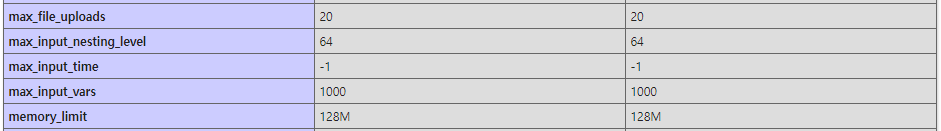

+++
title = "[PHP] POST 데이터가 잘리는 이유 (max_input_vars 설정)"
date = "2021-08-12"
draft = false
tags = ["PHP"]
+++

관리자 페이지에서 다량의 데이터를 입력하고 저장하는 기능을 개발하던 중 겪었던 이슈를 정리해본다.

해당 화면은 여러 항목을 한 번에 입력받아 PHP로 POST 요청을 보내는 구조였는데, 입력 가능한 항목 수가 많아지면서 일부 데이터가 정상적으로 저장되지 않는 문제가 발생했다.

네트워크 요청을 확인해보니 AJAX 요청 자체는 정상적으로 전송되고 있었지만, 서버에 도달한 POST 데이터는 입력한 값보다 적었다. 일정 개수 이상의 데이터는 아예 포함되지 않았고, 그 결과 일부 값이 누락된 상태로 저장되고 있었다.

처음에는 요청 처리 코드의 문제라고 생각했지만, 원인을 확인하는 과정에서 PHP의 `max_input_vars` 설정이 관련되어 있다는 것을 확인했다.

> **max_input_vars** <u>int</u>  
> How many <u>input variables</u>  may be accepted (limit is applied to $_GET, $_POST and $_COOKIE superglobal separately). Use of this directive mitigates the possibility of denial of service attacks which use hash collisions. If there are more input variables than specified by this directive, an **<u>E_WARNING</u>** is issued, and further input variables are truncated from the request.  

    출처: <a href="https://www.php.net/manual/en/info.configuration.php#ini.max-input-vars" style="color:#666666;">PHP 공식 문서 - max_input_vars</a>

공식 문서에서 설명하는 것처럼 `max_input_vars`는 PHP가 한 번의 요청에서 처리할 수 있는 입력 변수 수를 제한하는 설정이다. 따라서 입력 항목이 많은 화면에서는 POST 데이터의 크기와는 별개로, 전체 input 변수 개수가 제한값을 초과하면 일부 데이터가 잘릴 수 있다.

서버의 PHP 설정을 확인해보니, 실제로 `max_input_vars` 값이 기본값인 `1000`으로 설정되어 있었다.

이후 서버 환경에 맞게 `max_input_vars` 값을 조정한 뒤 다시 테스트해보니, 기존에 누락되던 POST 데이터가 정상적으로 모두 전달되는 것을 확인할 수 있었다.

입력 항목으 많은 화면에서는 요청 크기뿐 아니라 PHP 입력 변수 개수 제한도 함께 확인할 필요가 있다.
