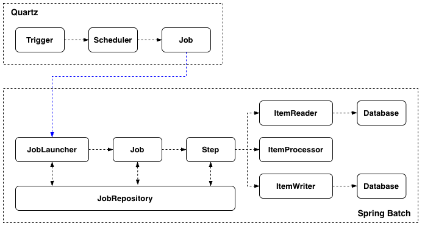

+++
title = "[Spring Boot] Spring Batch와 Quartz로 대용량 배치 예약 실행하기"
date = "2025-09-20"
draft = false
tags = ["Spring Boot", "Java"]
+++

#### Spring Batch와 Quartz를 함께 쓰게 된 이유

대용량 데이터를 처리해야 하는 상황이 생겼고, 이를 해결할 수 있는 방법을 찾다가 Spring Batch를 적용해보기로 했다. 다만 생성하는 배치 작업들은 정해진 주기로 반복되는 게 아니라, 원하는 주기를 예약하여 실행하고 싶었다. Spring이 기본으로 제공하는 `@Scheduled`는 일정한 주기로 반복 실행하는 데는 적합하지만, 실행 시점이 매번 달라지는 경우까지 다루기는 어려웠다. 그래서 스케줄링 라이브러리인 Quartz를 함께 사용하기로 했다. 이번 글에서는 Spring Batch로 대용량 데이터를 처리하고, Quartz로 실행 시점을 제어한 방법을 정리해보려고 한다.



전체 흐름을 보면 위쪽은 Quartz가, 아래쪽은 Spring Batch가 맡고 있는 영역이다. 아래에서 순서대로 Quartz가 무엇인지, Spring Batch가 무엇인지 살펴본 뒤, 이 둘을 실제로 어떻게 연결해서 사용했는지 적용 방법을 정리해보겠다.

#### Quartz란

Quartz는 원하는 시간에 작업을 예약하고 실행할 수 있는 스케줄링 라이브러리다. 크게 세 가지 요소로 구성된다.

- **Job**: 실행할 작업의 내용
- **Trigger**: Job이 언제 실행될지를 결정하는 조건
- **Scheduler**: Job과 Trigger를 등록해두고, 실행 시점이 되면 해당 Job을 실행시키는 주체

즉, Scheduler에 Job과 Trigger를 등록해두면 Trigger에 설정된 시점에 맞춰 Scheduler가 Job을 실행하는 방식으로 동작한다. 실제 코드로 보면, 실행할 Job을 `JobDetail`로 정의하고, 언제 실행할지를 `Trigger`로 정의한 다음, 이 둘을 Scheduler에 등록하는 순서로 사용한다.

```java
JobDetail jobDetail = JobBuilder.newJob()
        .ofType(QuartzJobLauncher.class)
        .withIdentity(jobKey)
        .storeDurably(true)
        .build();

Trigger trigger = TriggerBuilder.newTrigger()
        .forJob(jobKey)
        .withIdentity(triggerKey)
        .startAt(startAt)
        .withSchedule(SimpleScheduleBuilder.simpleSchedule().withRepeatCount(0))
        .build();

scheduler.addJob(jobDetail, false);
scheduler.scheduleJob(trigger);
```

`JobDetail`은 어떤 Job을 실행할지를 정의하고, `Trigger`는 그 Job을 언제 실행할지를 정의한다. `ofType`에는 Quartz의 실행 요청을 받아 처리하는 런처 클래스(`QuartzJobLauncher`)를 지정한다.

`Trigger`를 만들 때 사용한 옵션들도 하나씩 살펴보면, `forJob(jobKey)`는 이 Trigger가 앞서 등록한 `JobDetail`의 `jobKey`, 즉 어떤 Job과 연결될지를 지정한다. `withIdentity(triggerKey)`는 이 Trigger를 구분할 고유 식별자를 부여하고, `startAt(startAt)`은 이 Trigger가 최초로 실행될 시점을 지정한다. `withSchedule(...)`은 실행 주기를 지정하는 부분인데, 여기서는 `SimpleScheduleBuilder`에 `withRepeatCount(0)`을 줘서 반복 없이 `startAt`에 지정된 시점에 딱 한 번만 실행되도록 했다.

> **storeDurably**
>
> Quartz는 기본적으로 Trigger가 하나도 연결되지 않은 Job은 등록할 수 없다. `storeDurably(true)`를 설정하면 이 제약이 사라져서, Trigger 없이도 Job을 미리 등록해둘 수 있다. 덕분에 Job은 한 번만 등록해두고, 실행 시점이 다른 Trigger만 새로 만들어 등록하는 방식으로 하나의 Job을 재사용할 수 있다.

Trigger에는 여러 종류가 있는데, 특정 시점에 한 번만 실행하고 싶다면 위처럼 `SimpleTrigger`를, 일정한 주기로 반복 실행하고 싶다면 cron 표현식으로 주기를 지정하는 `CronTrigger`를 사용하면 된다.

```java
Trigger trigger = TriggerBuilder.newTrigger()
        .forJob(jobKey)
        .withIdentity(triggerKey)
        .withSchedule(CronScheduleBuilder.cronSchedule(cronExpression))
        .build();
```

Job과 Trigger는 한 번 등록하고 끝나는 게 아니라, 운영 중에 스케줄을 바꾸거나 취소하는 등의 제어도 필요하다. Scheduler는 이를 위한 메소드도 함께 제공한다.

- **scheduleJob**: Trigger를 등록해서 스케줄을 예약한다. (위에서 살펴본 코드가 여기 해당한다)
- **rescheduleJob**: 이미 등록된 Trigger를 새로운 Trigger로 교체한다. 실행 시점이나 파라미터를 바꾸고 싶을 때 사용한다.
- **unscheduleJob**: 등록된 Trigger를 삭제해서 스케줄을 취소한다.
- **pauseTrigger / resumeTrigger**: Trigger를 삭제하지 않고 잠깐 멈췄다가 다시 실행되도록 한다.

```java
scheduler.rescheduleJob(triggerKey, newTrigger);
scheduler.unscheduleJob(triggerKey);
scheduler.pauseTrigger(triggerKey);
scheduler.resumeTrigger(triggerKey);
```

작업 실행에 필요한 파라미터는 Trigger를 만들 때 `JobDataMap`에 담아서 함께 등록한다. Job은 하나만 등록해두고 여러 Trigger에서 함께 사용하기 때문에, 실행마다 달라지는 값은 Job이 아니라 Trigger 쪽에 실어야 각 실행마다 다른 파라미터를 가질 수 있다.

```java
JobDataMap jobDataMap = new JobDataMap();
jobDataMap.put("scheduleId", scheduleId);

Trigger trigger = TriggerBuilder.newTrigger()
        .forJob(jobKey)
        .withIdentity(triggerKey)
        .usingJobData(jobDataMap)
        .withSchedule(SimpleScheduleBuilder.simpleSchedule().withRepeatCount(0))
        .build();
```

이미 등록되어 있는 스케줄의 파라미터를 바꾸고 싶을 때는, `JobDataMap` 값을 바로 수정하는 방법으로는 적용되지 않는다. `pauseTrigger`/`resumeTrigger`는 실행 여부만 제어할 뿐 Trigger에 담긴 데이터를 바꿔주지는 않기 때문이다. 바뀐 값을 반영하려면 새로운 `JobDataMap`으로 Trigger를 새로 만들어서 `rescheduleJob`으로 기존 Trigger를 통째로 교체해야 한다.

```java
JobDataMap newJobDataMap = new JobDataMap();
newJobDataMap.put("scheduleId", scheduleId);

Trigger newTrigger = TriggerBuilder.newTrigger()
        .forJob(jobKey)
        .withIdentity(triggerKey)
        .usingJobData(newJobDataMap)
        .withSchedule(SimpleScheduleBuilder.simpleSchedule().withRepeatCount(0))
        .build();

scheduler.pauseTrigger(triggerKey);
scheduler.rescheduleJob(triggerKey, newTrigger);
```

#### Spring Batch란

Spring Batch는 대량의 데이터를 읽고, 가공하고, 저장하는 배치 작업에 최적화된 프레임워크다. 핵심 구성 요소는 다음과 같다.

- **Job**: 배치 작업 전체를 의미하며, 하나 이상의 Step으로 구성된다.
- **Step**: Job을 구성하는 하나의 처리 단위로, 실제 데이터 처리는 Step 안에서 이루어진다.
- **JobRepository**: Job과 Step의 실행 정보(이력, 상태 등)를 저장하고 관리한다. 실행 이력 관리, 중복 실행 방지, 실패 시 재시작 같은 기능이 여기서 가능해진다.
- **JobLauncher**: 등록된 Job을 `JobParameters`와 함께 실제로 실행시키는 진입점이다.

Step은 보통 청크(chunk) 단위로 데이터를 처리하는 방식을 사용하는데, 일정 크기만큼 데이터를 읽고(`ItemReader`) → 가공하고(`ItemProcessor`) → 저장(`ItemWriter`)하는 과정을 반복한다. 각 청크는 하나의 트랜잭션으로 묶여서, 처리 중 오류가 발생하면 해당 청크만 롤백된다.

```java
@Bean
public Job job(JobRepository jobRepository, Step step) {
    return new JobBuilder("job", jobRepository)
            .start(step)
            .build();
}

@Bean
public Step step(JobRepository jobRepository, PlatformTransactionManager transactionManager) {
    return new StepBuilder("step", jobRepository)
            .<Input, Output>chunk(CHUNK_SIZE, transactionManager)
            .reader(itemReader())
            .processor(itemProcessor())
            .writer(itemWriter())
            .build();
}
```

`Job`은 `JobBuilder`로, `Step`은 `StepBuilder`로 만들며, 둘 다 실행 정보를 기록할 `JobRepository`를 필요로 한다. `Step`은 청크 단위 트랜잭션을 관리할 `PlatformTransactionManager`와 함께 `reader`, `processor`, `writer`를 지정해서 구성한다.

> **Spring Batch 버전별 Job/Step 생성 방식**
>
> Spring Batch 4(Spring Boot 2) 버전까지는 `@EnableBatchProcessing`으로 자동 등록되는 `JobBuilderFactory`/`StepBuilderFactory`를 주입받아 `JobRepository`를 신경 쓰지 않고도 Job과 Step을 만들 수 있었다. 하지만 Spring Batch 5(Spring Boot 3)부터는 두 팩토리 클래스가 deprecated 되었고, 지금처럼 `JobBuilder`/`StepBuilder`를 직접 생성하면서 `JobRepository`(Step은 `PlatformTransactionManager`도 함께)를 명시적으로 전달해야 한다.

Step에서 사용하는 `reader`, `processor`, `writer`는 각각 다음과 같은 역할을 한다.

- **ItemReader**: 처리할 데이터를 하나씩 읽어온다. 청크 크기만큼 다 읽으면 다음 단계로 넘어간다.
- **ItemProcessor**: 읽어온 데이터를 가공하거나 필터링한다.
- **ItemWriter**: 가공된 데이터를 청크 단위로 모아서 한 번에 저장한다.

Job을 실행할 때는 `JobParameters`라는 값을 함께 전달할 수 있다. 이 값은 단순히 실행에 필요한 정보를 전달하는 용도이기도 하지만, Spring Batch가 하나의 실행(JobInstance)을 구분하는 기준으로도 쓰인다. 그래서 같은 Job이라도 `JobParameters`가 다르면 서로 다른 실행으로 인식하고, 반대로 동일한 `JobParameters`로는 이미 성공한 Job을 다시 실행할 수 없다.

`reader`, `processor`, `writer`에서 이 `JobParameters` 값을 받아쓰려면 `@JobScope`(Job 실행 단위) 또는 `@StepScope`(Step 실행 단위)를 함께 붙여야 한다. 일반적인 스프링 빈은 애플리케이션이 뜰 때 미리 만들어지기 때문에, 그 시점에는 아직 존재하지 않는 `JobParameters` 값을 주입받을 수 없다. `@JobScope`/`@StepScope`를 붙이면 빈이 생성되는 시점이 실제 Job/Step이 실행되는 시점으로 늦춰지고(Late Binding), 그제서야 `@Value("#{jobParameters['id']}")`처럼 실행 시점의 값을 주입받을 수 있게 된다.

```java
@Bean
@StepScope
public ItemReader<Input> itemReader(
        @Value("#{jobParameters['id']}") Long id
) {
    Info info = infoRepository.loadInfo(id); // (1)

    return new ItemReader<>() {
        private final List<Input> items = itemRepository.loadItems(id);
        private int index = 0;

        @Override
        public Input read() {
            if (index >= items.size()) {
                return null;
            }

            return items.get(index++); // (2)
        }
    };
}
```

여기서 눈여겨볼 부분은 (1)과 (2)의 실행 시점이 다르다는 점이다. `itemReader` 메소드 몸통, 즉 반환할 `ItemReader` 객체를 만들기 전까지의 코드(1)는 `@StepScope`에 의해 Step이 시작되는 시점에 딱 한 번만 실행된다. 반면 `read()` 메소드 안의 코드(2)는 Step이 진행되는 동안 아이템을 하나씩 반환할 때마다 반복해서 호출된다. 그래서 한 번만 조회하면 되는 값이나 검증 로직은 `read()` 바깥에 두고, 아이템마다 달라지는 로직만 `read()` 안에 둬야 불필요한 반복 호출을 피할 수 있다.

> **MyBatis ExecutorType.BATCH**
>
> MyBatis의 경우 `ExecutorType.BATCH` 옵션을 사용할 수 있다. 여러 건의 INSERT/UPDATE/DELETE 쿼리를 모아뒀다가 한 번에 전송해서, 매번 개별 쿼리를 날리는 것보다 네트워크 왕복 횟수를 줄일 수 있다. 다만 각 row를 여전히 개별 쿼리로 실행해서 모아 보내는 방식이라 BULK INSERT 구문 한 번으로 처리하는 것보다는 느리다. 그리고 `ExecutorType.BATCH`를 사용하면 MyBatis가 INSERT/UPDATE/DELETE의 반환값(영향받은 row 수)을 정확하게 돌려주지 않는다는 점도 주의해야 한다.

이 외에도 Spring Batch는 값을 공유하고 실행 흐름에 개입할 수 있는 여러 기능들을 제공한다. `ExecutionContext`는 Job 전체에서 공유되는 영역(`JobExecutionContext`)과 Step 안에서만 쓰이는 영역(`StepExecutionContext`)으로 나뉘어 있어서, 여기에 값을 저장해두고 필요한 곳에서 꺼내 쓸 수 있다. 또한 `JobExecutionListener`, `StepExecutionListener`, `ChunkListener` 같은 리스너를 등록해두면, Job·Step·Chunk가 실행되기 전후 시점에 원하는 로직을 끼워 넣을 수도 있다.

#### Quartz가 Spring Batch Job을 실행시키는 지점

Quartz의 Trigger가 발동되면, `JobDetail`에 등록해둔 Job 클래스의 `execute` 메소드가 실행된다. 그래서 Quartz와 Spring Batch를 이어주는 `QuartzJobLauncher`라는 클래스를 구현해보았다.

```java
@Component
@RequiredArgsConstructor
@DisallowConcurrentExecution
public class QuartzJobLauncher extends QuartzJobBean {
    private final JobLauncher jobLauncher;
    private final ApplicationContext applicationContext;

    @Override
    protected void executeInternal(JobExecutionContext context) {
        try {
            Map<String, Job> jobMap = applicationContext.getBeansOfType(Job.class);
            JobDataMap jobDataMap = context.getTrigger().getJobDataMap();
            String jobName = context.getJobDetail().getKey().getName();

            if (jobMap.containsKey(jobName)) {
                JobParameters jobParameters = convertJobDataMapToJobParameters(jobDataMap);
                jobLauncher.run(jobMap.get(jobName), jobParameters);
            }
        } catch (Exception e) {
            ...
        }
    }

    private JobParameters convertJobDataMapToJobParameters(JobDataMap jobDataMap) {
        JobParametersBuilder jobParametersBuilder = new JobParametersBuilder();

        for (Map.Entry<String, Object> entry : jobDataMap.entrySet()) {
            jobParametersBuilder.addString(entry.getKey(), entry.getValue().toString());
        }

        jobParametersBuilder.addString("timestamp", String.valueOf(System.currentTimeMillis()));
        return jobParametersBuilder.toJobParameters();
    }
}
```

`@DisallowConcurrentExecution`은 같은 Job이 아직 실행 중일 때, 같은 Trigger가 다시 발동되더라도 중복으로 실행되지 않도록 막아주는 어노테이션이다.

`executeInternal` 메소드에서는 먼저 `ApplicationContext`를 통해 등록된 모든 Spring Batch `Job` 빈을 조회한다. 그리고 `JobDetail`을 등록할 때 사용했던 `JobKey`의 이름을 그대로 실행할 Job 빈의 이름으로 사용하기 때문에, Trigger가 발동되었을 때 어떤 Job을 실행해야 하는지는 `context.getJobDetail().getKey().getName()`으로 바로 확인할 수 있다. 그래서 Quartz Job을 등록할 때 `JobKey`에 지정하는 이름은 실행하려는 Spring Batch `Job` 빈의 이름과 일치하게 하였다.

이렇게 실행할 Job을 찾으면, Trigger에 담아뒀던 `JobDataMap`을 Spring Batch의 `JobParameters`로 변환해서 `JobLauncher`로 실행시킨다. 애초에 Quartz Trigger를 등록할 때 `JobDataMap`에 값을 담아뒀던 이유가 여기에 있다 — Quartz 스케줄을 예약하는 시점에 넘겨준 값을, Spring Batch가 실제로 실행되는 시점에 `JobParameters`로 그대로 전달하기 위해서다.

`JobDataMap`은 `context.getMergedJobDataMap()`으로 JobDetail과 Trigger에 담긴 값을 합쳐서 가져올 수도 있다. 하지만 Trigger마다 실행에 필요한 파라미터가 달라질 수 있기 때문에, Job(JobDetail) 쪽에는 파라미터를 넣을 생각을 하지 않고 Trigger에만 담아두는 방식으로 구현했다. 그래서 `context.getTrigger().getJobDataMap()`으로 Trigger에 담긴 값만 가져오게 하였다.

Spring Batch는 동일한 `JobParameters`로 이미 완료된 Job을 다시 실행하면 `JobInstanceAlreadyCompleteException`을 던지며 재실행을 막는다. 그런데 일정 주기로 반복 실행되는 `CronTrigger` 기반의 배치 작업을 생각했을 때 `JobDataMap`에 담긴 값만으로 `JobParameters`를 만들면 실행할 때마다 파라미터가 동일해지고, 두 번째 실행부터는 곧바로 `JobInstanceAlreadyCompleteException`이 발생한다. 그래서 매번 달라지는 `timestamp` 값을 파라미터에 항상 추가해서, Spring Batch가 매 실행을 새로운 실행으로 인식할 수 있도록 `convertJobDataMapToJobParameters`를 구현했다.

#### Quartz만 Spring Batch Job을 실행할 수 있도록 막기

Spring Boot는 기본적으로 애플리케이션이 시작될 때, 컨텍스트에 등록된 Job 빈을 자동으로 실행하는 `JobLauncherApplicationRunner`를 제공한다. 하지만 원하는 실행 흐름은 애플리케이션이 뜨는 시점이 아니라, 오직 Quartz Trigger가 발동했을 때만 실행되는 것이었다. 그래서 이 자동 실행부터 막아야 했다.

```yaml
spring:
  batch:
    job:
      enabled: false
      name: ${job.name:NONE}
    jdbc:
      initialize-schema: never
```

`spring.batch.job.enabled`를 `false`로 설정해서 애플리케이션이 시작될 때 Job이 자동 실행되지 않도록 막았다. `enabled` 값이 잘못 켜지는 경우를 대비해서, `job.name`도 존재하지 않는 Job 이름인 `NONE`을 기본값으로 잡아두었다.

Spring Batch는 Job과 Step의 실행 이력을 `BATCH_JOB_INSTANCE`, `BATCH_JOB_EXECUTION` 같은 메타데이터 테이블에 기록하고, 이 테이블을 기준으로 실행 이력 관리나 중복 실행 방지, 재시작 같은 기능을 제공한다. 이 테이블의 스키마를 애플리케이션이 자동으로 만들어줄지를 결정하는 `spring.batch.jdbc.initialize-schema` 옵션은 `never`로 지정해뒀다.

```java
@Configuration
@EnableConfigurationProperties(BatchProperties.class)
public class BatchConfig extends DefaultBatchConfiguration {
    private final DataSource dataSource;
    private final PlatformTransactionManager transactionManager;

    public BatchConfig(
            @Qualifier("batchDataSource") DataSource dataSource,
            @Qualifier("batchTransactionManager") PlatformTransactionManager transactionManager
    ) {
        this.dataSource = dataSource;
        this.transactionManager = transactionManager;
    }

    @Bean
    @ConditionalOnProperty(prefix = "spring.batch.job", name = "enabled", havingValue = "true", matchIfMissing = true)
    public JobLauncherApplicationRunner jobLauncherApplicationRunner(
            JobLauncher jobLauncher,
            JobExplorer jobExplorer,
            JobRepository jobRepository,
            BatchProperties batchProperties
    ) {
        JobLauncherApplicationRunner jobLauncherApplicationRunner = new JobLauncherApplicationRunner(jobLauncher, jobExplorer, jobRepository);
        String jobName = batchProperties.getJob().getName();

        if (StringUtils.hasText(jobName)) {
            jobLauncherApplicationRunner.setJobName(jobName);
        }

        return jobLauncherApplicationRunner;
    }

    @Override
    public DataSource getDataSource() {
        return dataSource;
    }

    @Override
    public PlatformTransactionManager getTransactionManager() {
        return transactionManager;
    }
}
```

`DefaultBatchConfiguration`을 상속해서 `getDataSource()`/`getTransactionManager()`를 오버라이드한 이유는 Spring Batch가 실행 이력을 기록하는 `JobRepository`의 메타데이터 테이블이 애플리케이션의 기본 DataSource가 아니라 별도로 분리해둔 배치 전용 DataSource를 쓰도록 지정하기 위해서다. 그리고 `jobLauncherApplicationRunner`도 `spring.batch.job.enabled` 프로퍼티 값에 따라 켜고 끌 수 있게 직접 등록해서 Job을 자동으로 실행할지 말지를 이 설정 하나로 결정할 수 있게 했다.

`@ConditionalOnProperty(prefix = "spring.batch.job", name = "enabled", havingValue = "true", matchIfMissing = true)`가 바로 `enabled` 값을 읽어서 반영하는 부분이다. `havingValue = "true"`는 프로퍼티 값이 `true`일 때만 이 빈을 등록한다는 뜻이고, `matchIfMissing = true`는 프로퍼티 자체가 없을 때는 기본적으로 등록한다는 뜻이다. `spring.batch.job.enabled: false`로 명시해뒀기 때문에 이 빈은 만들어지지 않고, 결과적으로 애플리케이션이 시작될 때 어떤 Job도 자동 실행되지 않는다.

#### 여러 서버에서 같은 배치가 중복 실행되지 않도록 막기

서버가 여러 대일 경우 각 서버가 저마다 독립된 Quartz Scheduler를 띄우게 되면서 같은 Trigger가 여러 서버에서 동시에 발동할 수 있다. Quartz는 Scheduler의 상태를 DB에 저장하는 JDBC 기반 JobStore를 클러스터 모드로 사용하면, 여러 서버가 같은 DB를 공유하면서도 실제로는 그중 한 서버에서만 Trigger가 발동되도록 한다.

```yaml
spring:
  quartz:
    job-store-type: jdbc
    jdbc:
      initialize-schema: never
    properties:
      org:
        quartz:
          jobStore:
            class: org.quartz.impl.jdbcjobstore.JobStoreTX
            isClustered: true
```

`job-store-type: jdbc`로 설정하면 Quartz도 Job과 Trigger의 상태를 메모리가 아니라 DB의 메타데이터 테이블에 저장하고, 이 테이블을 기준으로 스케줄을 관리한다. `isClustered: true`로 설정하면 여러 서버가 같은 테이블을 공유하게 되고 같은 배치 작업이 중복 실행되지 않는다.

`spring.batch.jdbc.initialize-schema`와 `spring.quartz.jdbc.initialize-schema`는 둘 다 기본값이 `embedded`인데 이 값은 DataSource가 H2·HSQLDB 같은 내장형(embedded) 데이터베이스로 감지될 때만 스키마를 자동으로 생성해준다는 뜻이다. 그래서 MySQL과 같은 실제 DB를 쓰는 환경에서는 기본값 상태로도 애초에 자동으로 스키마를 건드리지 않는다. 그럼에도 두 값을 명시적으로 `never`로 지정한 이유는, 운영 환경에서는 테이블을 자동으로 생성하지 않는다는 걸 명시적으로 드러내기 위해 설정해두었다.

> **메타 테이블 직접 생성하기**
>
> `never`로 설정하면 테이블은 직접 만들어야 한다. 테이블 생성 스크립트 경로는 다음과 같다.
>
> - Spring Batch: `spring-batch-core` 라이브러리의 `org/springframework/batch/core/schema-*.sql` (MySQL 기준 `schema-mysql.sql`)
> - Quartz: `quartz-scheduler` 라이브러리의 `org/quartz/impl/jdbcjobstore/tables_*.sql` (MySQL InnoDB 기준 `tables_mysql_innodb.sql`)
