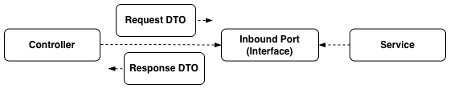
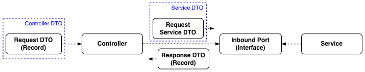

+++
title = "[Spring Boot] Controller와 Service DTO 분리하기"
date = "2025-05-15"
draft = false
tags = ["Spring Boot", "Java"]
+++

#### DTO를 분리하게 된 이유



헥사고날 아키텍처를 적용하며 외부 요청 파라미터를 내부 영역으로 전달하고 반환할 때 DTO를 사용했다. 하지만 외부 영역과 내부 영역에서 같은 요청 DTO를 사용하고 있었기 때문에 여전히 클래스 간의 결합도가 높았다. 그래서 외부 영역과 내부 영역에서 사용하는 전달 객체를 나누고, 더 작은 책임을 가질 수 있도록 개선해보기로 했다.

#### Controller DTO의 현재 상태

```java
@RestController
@RequiredArgsConstructor
@RequestMapping("/api/documents")
public class DocumentController {
    private final DocumentInboundPort documentInboundPort;

    // 게시글 목록 조회
    @GetMapping
    public ResponseEntity<ApiResponse<List<DocumentResponse>>> getDocuments(
            @RequestParam(value = "user_id", required = false) String userId,
            @RequestParam(value = "tag_ids", required = false) String tagIds,
            @RequestParam(value = "page", required = false) Integer page,
            @RequestParam(value = "page_size", required = false) Integer pageSize
    ) {
        DocumentsRequest documentsRequest = DocumentsRequest.builder()
                .userId(userId)
                .tagIds(tagIds)
                .page(page)
                .pageSize(pageSize)
                .build();

        List<DocumentResponse> result = documentInboundPort.getDocuments(documentsRequest);
        return ResponseEntity.ok(new ApiResponse<>(200, "SUCCESS", result));
    }

    // 게시글 등록
    @PostMapping
    public ResponseEntity<ApiResponse<InsertDocumentResponse>> insertDocument(
            @RequestBody InsertDocumentRequest insertDocumentRequest
    ) {
        InsertDocumentResponse result = documentInboundPort.insertDocument(insertDocumentRequest);
        return ResponseEntity.ok(new ApiResponse<>(200, "SUCCESS", result));
    }
}
```

게시글 목록 조회 메서드(`getDocuments`)는 GET 요청이라 `@RequestParam`으로 파라미터를 하나씩 받은 뒤 컨트롤러 안에서 직접 `DocumentsRequest` 객체로 조립하고 있다. 반면 게시글 등록 메서드(`insertDocument`)는 POST 요청이라 `@RequestBody`로 처음부터 DTO 그대로 전달받는다. 조회 메서드는 이렇게 파라미터를 하나씩 받다 보니, 파라미터가 추가될 때마다 `DocumentController`의 메서드까지 함께 수정해야 하는 문제가 있었다. 그래서 조회 메서드도 등록 메서드처럼 DTO로 바로 전달받을 수 있도록 `@ModelAttribute`를 적용해보기로 했다.

#### @ModelAttribute 적용하기

```java
@GetMapping
public ResponseEntity<ApiResponse<List<DocumentResponse>>> getDocuments(
        @ModelAttribute DocumentsRequest documentsRequest
) {
    List<DocumentResponse> result = documentInboundPort.getDocuments(documentsRequest);
    return ResponseEntity.ok(new ApiResponse<>(200, "SUCCESS", result));
}
```

```java
@NoArgsConstructor
public class DocumentsRequest {
    private String userId;
    private String tagIds;
    private Integer page;
    private Integer pageSize;
}
```

`@ModelAttribute`는 쿼리 문자열(Query String)이나 폼(Form) 데이터로 전달된 파라미터를 객체로 바인딩해주는 어노테이션이다. 그래서 위와 같이 바꿔봤는데, 요청 파라미터가 `DocumentsRequest` 객체로 제대로 바인딩되지 않았다. 이유는 두 가지였다.

1. **변환 대상인 객체의 생성자 형태에 따라 바인딩 방식이 달라진다.** `DocumentsRequest`는 `@NoArgsConstructor`로 생성된 기본 생성자만 가지고 있는 상태다. `@ModelAttribute`는 매개변수가 없는 기본 생성자만 있을 경우 `setter` 메서드가 있어야 필드에 바인딩할 수 있는데, 지금은 `setter`가 없다. 반대로 매개변수가 있는 생성자를 가지고 있다면 `setter` 없이도 그 생성자를 사용해서 초기화한다.

> `@NoArgsConstructor`와 `@AllArgsConstructor`를 같이 사용하는 경우에도 `setter` 메서드가 필요하다. 생성자가 2개 이상일 때는 매개변수가 없는 기본 생성자가 사용되도록 `@ModelAttribute` 내부 로직에 구현되어 있기 때문이다.

2. **변환 대상인 객체의 필드 이름과 요청 파라미터의 키가 정확하게 일치해야 바인딩이 이루어진다.** 요청 파라미터는 `user_id`, `tag_ids`처럼 스네이크 표기법(snake_case)인데, `DocumentsRequest`의 필드 이름은 `userId`, `tagIds`처럼 카멜 표기법(camelCase)이라 서로 일치하지 않는다.

#### Record 클래스 타입 적용하기

Record는 Java 14에서 처음 소개된 클래스 타입으로, 불변의 데이터 객체를 더 간결하고 효율적으로 만들 수 있게 해준다. `getter`, `equals`, `hashCode`, `toString`과 함께 모든 필드를 초기화하는 생성자까지 자동으로 생성해준다. `setter`나 `@NoArgsConstructor`, `@AllArgsConstructor` 같은 어노테이션 없이도 불변 데이터 객체 역할을 할 수 있어서, Controller DTO에 적합한 타입이라고 생각했다.

```java
public record DocumentsRequest(
        String userId,
        String tagIds,
        Integer page,
        Integer pageSize
) {
    // 컴팩트 생성자(Compact Constructor)
    public DocumentsRequest {
        // page 값이 없거나 0 이하일 경우 기본값 1 설정
        page = (page == null || page <= 0) ? 1 : page;
        // pageSize 값이 없거나 0 이하일 경우 기본값 20 설정
        pageSize = (pageSize == null || pageSize <= 0) ? 20 : pageSize;
    }
}
```

일반 클래스와는 선언 방식이 다른데, 불변성을 보장하는 클래스라 기본 생성자나 매개변수가 있는 생성자를 따로 구현할 수 없다. 대신 **컴팩트 생성자(Compact Constructor)**를 사용해서, 필드 값이 초기화되기 전에 값을 검증하거나 조정할 수 있다. 위 코드에서는 `page`와 `pageSize` 값이 없을 때 기본값을 설정하도록 했다.

#### @BindParam 적용하기

> DataBinder now supports constructor binding where argument values are looked up through a NameResolver (e.g. in the HTTP request parameters map), and those lookups can be customized through an `@BindParam` annotation.
>
> 출처: [Spring Framework 6.1 Release Notes](https://github.com/spring-projects/spring-framework/wiki/Spring-Framework-6.1-Release-Notes)

Spring Framework 6.1부터 도입된 기능으로, 생성자 파라미터에 `@BindParam`을 사용하면 바인딩할 요청 파라미터의 키를 직접 지정할 수 있다. 필드마다 아래와 같이 지정해주면 된다.

```java
public record DocumentsRequest(
        @BindParam("user_id")
        String userId,
        @BindParam("tag_ids")
        String tagIds,
        @BindParam("page")
        Integer page,
        @BindParam("page_size")
        Integer pageSize
) {
    public DocumentsRequest {
        page = (page == null || page <= 0) ? 1 : page;
        pageSize = (pageSize == null || pageSize <= 0) ? 20 : pageSize;
    }
}
```

이제 필드 이름(`tagIds`, `page`, `pageSize`)이 요청 파라미터 키(`tag_ids`, `page`, `page_size`)와 달라도, `@BindParam`에 지정한 키를 기준으로 바인딩된다. 이렇게 생성자 형태와 이름 불일치 문제를 모두 해결해서, 게시글 목록 조회 메서드도 등록 메서드처럼 `@ModelAttribute` 하나로 요청을 받을 수 있게 되었다.

#### Service DTO 생성하기

Controller DTO는 외부 요청을 받는 역할에 집중하고, 서비스 로직에 필요한 검증과 가공은 별도의 Service DTO에서 진행하도록 `DocumentsRequestModel`을 만들었다.

```java
@Getter
public class DocumentsRequestModel {
    private String userId;
    private String tagIds;
    private int page;
    private int pageSize;

    private Set<Integer> tagIdSet;

    @Builder
    public DocumentsRequestModel(
            String userId,
            String tagIds,
            int page,
            int pageSize
    ) {
        // 회원 ID 검증(예시)
        if (!StringUtils.hasText(userId)) {
            throw new ApiException("회원 ID를 입력해주세요.");
        }

        this.userId = userId;
        this.tagIds = tagIds;
        this.page = page;
        this.pageSize = pageSize;

        // tagIds 가공(예시)
        if (StringUtils.hasText(this.tagIds)) {
            // 집합 변환(Integer)
            this.tagIdSet = Arrays.stream(this.tagIds.split(","))
                    .map(tagId -> {
                        try {
                            return Integer.parseInt(tagId.trim());
                        } catch (NumberFormatException e) {
                            throw new ApiException("태그 ID를 올바르게 입력해주세요.");
                        }
                    })
                    .collect(Collectors.toSet());
        }
    }
}
```

**원시 타입 사용**: Controller DTO에서 이미 `page`, `pageSize`의 기본값을 채워주기 때문에, Service DTO에서는 참조 타입 대신 원시 타입(`int`)을 사용할 수 있었다. 그만큼 불필요한 null 체크를 하지 않아도 된다.

**요청 파라미터 검증**: 서비스 로직에서 필요한 값의 존재 여부나 형식을 검증한다. 위 코드에서는 회원 ID가 없으면 예외를 발생시키도록 했는데, 이렇게 서비스 영역에 도달하기 전에 검증을 끝내두면 서비스 로직은 핵심 처리에만 집중할 수 있다.

**요청 파라미터 가공**: 서비스 로직에서 원하는 타입이 있다면 미리 가공해서 전달한다. 위 코드에서는 콤마로 구분된 태그 ID 문자열(`tagIds`)을 `Set<Integer>`(`tagIdSet`)로 변환해서 전달했다.

#### 정리



Response DTO도 데이터 객체로서의 역할만 하기 때문에 Record 타입으로 바꿨다. DTO의 수는 늘었지만, Controller와 Service가 각자의 책임에 맞는 DTO를 갖게 되면서 두 영역 사이의 결합도가 낮아지고 유지보수성이 좋아졌다.