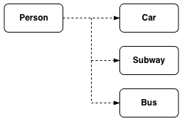
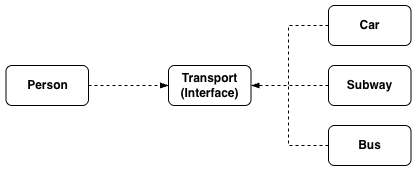
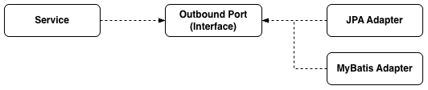

+++
title = "[Spring Boot] 의존 역전 원칙(DIP)"
date = "2025-05-12"
draft = false
tags = ["Spring Boot", "Java"]
+++

#### DIP를 정리하게 된 이유

헥사고날 아키텍처는 객체 지향 설계의 5가지 원칙 중 하나인 의존 역전 원칙(DIP, Dependency Inversion Principle)을 적용한 아키텍처 패턴이라고 볼 수 있다. 이 원칙은 클린 아키텍처의 중요한 원칙 중 하나이기도 해서, 이번 글에서는 관련 내용을 정리해보려고 한다.

#### DIP(Dependency Inversion Principle, 의존 역전 원칙)

의존 역전 원칙이란, 고수준 모듈은 저수준 모듈 구현에 의존해서는 안 되며, 두 모듈 모두 다른 추상화된 것에 의존해야 한다는 원칙이다.

| 구분 | 고수준 모듈(High Level Module) | 저수준 모듈(Low Level Module) |
|------|------|------|
| 설명 | 더 큰 규모의 기능을 수행하는 모듈 | 고수준 모듈에서 정의한 기능을 구체적으로 구현하는 모듈 |
| 예시 | 데이터를 조회한다. | 입력된 값으로 데이터를 찾아 반환한다. |

#### DIP 위반 예시

의존 역전 원칙을 사람이 이용하는 교통수단에 비유해서 설명해보겠다.

```java
// 사람 클래스(고수준 모듈)
public class Person {
    private Car car;

    public Person() {
        this.car = new Car();
    }

    public void move() {
        car.move();
    }
}

// 자동차 클래스(저수준 모듈)
public class Car {
    public void move() {
        System.out.println("차를 타고 이동한다.");
    }
}

// 지하철 클래스(저수준 모듈)
public class Subway {
    public void move() {
        System.out.println("지하철을 타고 이동한다.");
    }
}

// 버스 클래스(저수준 모듈)
public class Bus {
    public void move() {
        System.out.println("버스를 타고 이동한다.");
    }
}
```



`Person`(고수준 모듈)이 `Car`(저수준 모듈)에 직접 의존하고 있다. 만약 자동차가 아닌 지하철이나 버스로 이동해야 하는 상황이 오면, `Person`의 필드 타입을 `Subway`나 `Bus`로 바꿔야 하고 `move` 메서드도 함께 수정해야 한다. 즉, 구체적으로 구현된 저수준 모듈에 의존하다 보니 클래스 간의 결합도가 높아지고, 그만큼 유지보수가 어려워진다.

#### DIP 적용 예시

```java
// 사람 클래스(고수준 모듈)
public class Person {
    private Transport transport;

    public Person(Transport transport) {
        this.transport = transport;
    }

    public void move() {
        transport.move();
    }
}

// 교통수단 인터페이스(추상화)
public interface Transport {
    void move();
}

// 자동차 클래스(저수준 모듈)
public class Car implements Transport {
    public void move() {
        System.out.println("차를 타고 이동한다.");
    }
}

// 지하철 클래스(저수준 모듈)
public class Subway implements Transport {
    public void move() {
        System.out.println("지하철을 타고 이동한다.");
    }
}

// 버스 클래스(저수준 모듈)
public class Bus implements Transport {
    public void move() {
        System.out.println("버스를 타고 이동한다.");
    }
}
```

```java
public class Main {
    public static void main(String[] args) {
        Transport car = new Car();
        Person personWithCar = new Person(car);
        personWithCar.move(); // "차를 타고 이동한다."

        Transport subway = new Subway();
        Person personWithSubway = new Person(subway);
        personWithSubway.move(); // "지하철을 타고 이동한다."

        Transport bus = new Bus();
        Person personWithBus = new Person(bus);
        personWithBus.move(); // "버스를 타고 이동한다."
    }
}
```



`Person`이 구체적인 저수준 모듈(`Car`, `Subway`, `Bus`)에 의존하는 대신, 추상화된 `Transport` 인터페이스에만 의존하도록 바꿨다. 그리고 `Car`, `Subway`, `Bus`도 각각 `Transport` 인터페이스를 구현하게 되었다. 즉, 의존의 방향이 역전되어 고수준 모듈과 저수준 모듈이 모두 추상화된 인터페이스에 의존하게 된 것이다. 이렇게 하면 다른 교통수단이 추가되더라도 `Person`은 전혀 영향을 받지 않는다.

#### 헥사고날 아키텍처에서의 DIP 적용

지난 글에서 만든 `DocumentService`와 `DocumentOutboundPort`도 같은 원리로 동작한다.

```java
@Service
@RequiredArgsConstructor
public class DocumentService implements DocumentInboundPort {
    private final DocumentOutboundPort documentOutboundPort;

    @Override
    public DocumentResponse getDocument(DocumentRequest documentRequest) {
        Document document = documentOutboundPort.loadDocument(documentRequest.getIdx());
        ...
    }
}
```

```java
public interface DocumentOutboundPort {
    Document loadDocument(int idx);
}
```

```java
@Repository
@RequiredArgsConstructor
public class DocumentJpaAdapter implements DocumentOutboundPort {
    private final DocumentRepository documentRepository;

    @Override
    public Document loadDocument(int idx) {
        DocumentEntity documentEntity = documentRepository.findByIdx(idx);

        return Document.builder()
                .idx(documentEntity.getIdx())
                .userId(documentEntity.getUserId())
                .title(documentEntity.getTitle())
                .content(documentEntity.getContent())
                .status(documentEntity.getStatus())
                .build();
    }
}
```


`DocumentService`는 `DocumentOutboundPort` 인터페이스를 통해서만 `DocumentJpaAdapter`를 호출한다. 이번에는 DB 접근 방식을 MyBatis로 바꾼다고 가정해보자.

```java
@Component
@RequiredArgsConstructor
public class DocumentMybatisAdapter implements DocumentOutboundPort {
    private final SqlSessionTemplate sqlSessionTemplate;

    @Override
    public Document loadDocument(int idx) {
        DocumentVo documentVo = sqlSessionTemplate.getMapper(DocumentDao.class).getDocument(idx);

        return Document.builder()
                .idx(documentVo.getIdx())
                .userId(documentVo.getUserId())
                .title(documentVo.getTitle())
                .content(documentVo.getContent())
                .status(documentVo.getStatus())
                .build();
    }
}
```



서비스 영역과 외부 시스템 영역 모두 추상화된 `DocumentOutboundPort` 인터페이스에 의존하고 있기 때문에, `DocumentMybatisAdapter`가 추가되더라도 `DocumentService`는 전혀 수정할 필요가 없다.

> **컴파일 타임 의존(Compile Time Dependency)과 런타임 의존(Runtime Dependency)**
>
> 컴파일 타임 의존이란 코드가 컴파일되는 시점에 의존성을 결정하는 것을 의미하며, 런타임 의존이란 코드가 실행되는 시점에 의존성을 결정하거나 주입하는 것을 의미한다.
>
> `DocumentService`, `DocumentJpaAdapter`, `DocumentMybatisAdapter`는 모두 코드 컴파일 시점에 `DocumentOutboundPort` 인터페이스를 필요로 하므로 컴파일 타임 의존을 하고 있다. 반면 코드 실행 시점에는 `DocumentJpaAdapter`와 `DocumentMybatisAdapter` 중 하나가 바인딩되는데, 이는 런타임 의존의 예에 해당한다.