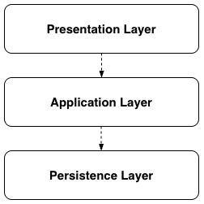
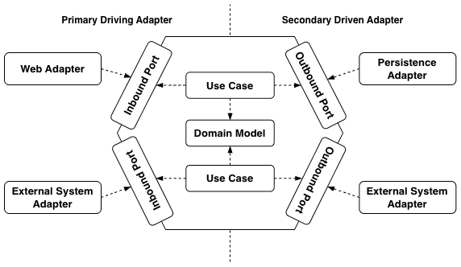

+++
title = "[Spring Boot] 계층형 아키텍처와 헥사고날 아키텍처"
date = "2025-05-10"
draft = false
tags = ["Spring Boot", "Java"]
+++

#### 아키텍처를 다시 고민하게 된 이유

도메인 주도 설계(Domain-Driven Design)를 공부하면서 코드 아키텍처도 함께 찾아보게 되었고, 그 과정에서 헥사고날 아키텍처(Hexagonal Architecture)에 대해서도 알게 되었다. 그리고 이를 실무에 적용해보고 싶었다. 그래서 이번 기회를 통해 게시글을 조회하는 예시 코드를 사용하여 계층형 아키텍처와 헥사고날 아키텍처를 비교해보려고 한다.

#### 계층형 아키텍처(Layered Architecture)란



계층형 아키텍처는 코드의 역할과 관심사에 따라 계층으로 분리한 아키텍처 패턴이다. 사용자의 요청을 처리하는 **표현 계층**(Presentation Layer), 서비스 핵심 로직을 수행하는 **애플리케이션 계층**(Application Layer), 영구 데이터를 관리하는 **영속 계층**(Persistence Layer)으로 나누는 것이 일반적이다. 게시글을 단일 조회하는 예시 코드로 각 계층이 어떻게 구성되는지 살펴보겠다.

```markdown
├── controller
│   └── DocumentController.java
├── dao
│   └── DocumentDao.java
├── dto
│   └── DocumentResponse.java
└── service
    └── DocumentService.java
```

```java
@RestController
@RequiredArgsConstructor
@RequestMapping("/api/documents")
public class DocumentController {
    private final DocumentService documentService;

    @GetMapping("/{id}")
    public ResponseEntity<ApiResponse<DocumentResponse>> getDocument(
            @PathVariable(value = "id") int id,
            @RequestParam(value = "access_user_id", required = false) String accessUserId
    ) {
        DocumentResponse result = documentService.getDocument(id, accessUserId);
        return ResponseEntity.ok(new ApiResponse<>(200, "SUCCESS", result));
    }
}
```

표현 계층에 해당하는 `DocumentController`는 요청을 받아 애플리케이션 계층인 `DocumentService`에 전달하는 역할만 한다.

```java
@Service
@RequiredArgsConstructor
public class DocumentService {
    private final SqlSessionTemplate sqlSessionTemplate;

    public DocumentResponse getDocument(int id, String accessUserId) {
        // 게시글 번호 검증
        if (id == 0) {
            throw new ApiException("게시글 번호를 올바르게 입력해주세요.");
        }

        // 게시글 단일 조회
        Document document = sqlSessionTemplate.getMapper(DocumentDao.class).getDocument(id);

        // 접근한 회원이 작성자가 아니며, 비밀글인 경우
        if (!document.getUserId().equals(accessUserId) && "SECRET".equals(document.getStatus())) {
            document.setContent("비밀글입니다.");
        }

        return DocumentResponse.builder()
                .id(document.getId())
                .title(document.getTitle())
                .content(document.getContent())
                .build();
    }
}
```

애플리케이션 계층에 해당하는 `DocumentService`는 `SqlSessionTemplate`을 직접 주입받아 영속 계층에 접근하고, 그 안에서 파라미터 검증과 비밀글 처리 로직까지 함께 수행한다.

```java
@Getter
@Setter
@Builder
public class Document {
    private int id;
    private String userId;
    private String title;
    private String content;
    private String status;
}
```

영속 계층에서 조회한 데이터는 `Document` 객체로 반환되는데, 데이터만 가지고 있는 형태다.

#### 계층형 아키텍처의 문제점

`DocumentService`를 보면 몇 가지 문제가 보인다.

1. **파라미터 검증 책임이 서비스 계층에 있다.**

```java
// 게시글 번호 검증
if (id == 0) {
    throw new ApiException("게시글 번호를 올바르게 입력해주세요.");
}
```

서비스 계층에 게시글 번호에 대한 검증 로직이 구현되어 있었다. 즉, 서비스 로직 구현에 대한 책임뿐만 아니라 요청된 파라미터에 대한 검증 책임까지 맡고 있는 것이다. 책임이 엄격하게 구분되어 있지 않기 때문에, 서비스 계층이 핵심 로직에 집중하지 못하고 있다.

2. **도메인 책임이 서비스 계층에 있다.**

```java
// 접근한 회원이 작성자가 아니며, 비밀글인 경우
if (!document.getUserId().equals(accessUserId) && "SECRET".equals(document.getStatus())) {
    document.setContent("비밀글입니다.");
}
```

`Document`는 행동이 아닌 데이터의 역할만 하고 있기 때문에, 비밀글을 처리하는 책임이 서비스 계층에 남아있다. 이렇게 되면 비밀글 처리가 필요한 다른 메서드에도 같은 로직을 반복해서 넣어야 하고, 처리 방식이 바뀌면 그 모든 곳을 다 찾아 고쳐야 한다.

3. **서비스 계층과 영속 계층이 강하게 결합되어 있다.**

```java
Document document = sqlSessionTemplate.getMapper(DocumentDao.class).getDocument(id);
```

`DocumentService`가 `SqlSessionTemplate`을 직접 주입받아 사용하고 있다. 만약 DB 접근 방식을 MyBatis에서 JPA로 변경한다면, `SqlSessionTemplate`을 사용하는 모든 메서드를 수정해야 하므로 서비스 계층에도 직접적인 영향이 생긴다.

#### 헥사고날 아키텍처(Hexagonal Architecture)란



헥사고날 아키텍처는 다른 말로 포트와 어댑터 아키텍처(Ports and Adapters Architecture)라고도 하는데, 도메인 비즈니스 로직을 중앙에 두고 포트(Port)와 어댑터(Adapter)를 통해 외부 요소(UI, Persistence 등)와 연결하는 아키텍처 패턴이다. 즉, 애플리케이션 코어 로직을 외부 요소로부터 분리하는 것을 목표로 한다.

| 포트 | 설명 |
|------|------|
| 인바운드 포트(Inbound Port) | 외부에서 애플리케이션 코어로 들어오는 요청을 처리하는 인터페이스. ex) `Controller` - **Inbound Port** - `Service` |
| 아웃바운드 포트(Outbound Port) | 애플리케이션 코어가 외부 시스템과 통신하기 위한 인터페이스. ex) `Service` - **Outbound Port** - `Repository` |

| 어댑터 | 설명 |
|------|------|
| 인바운드 어댑터(Inbound Adapter) | 외부 요청을 받아 애플리케이션 코어로 전달하는 역할(Driving Adapter) |
| 아웃바운드 어댑터(Outbound Adapter) | 애플리케이션 코어에서 외부 시스템으로 접근하는 역할(Driven Adapter) |

앞서 계층형 아키텍처에서는 계층 간에 강하게 결합된 부분이 있었고 도메인 모델도 없었기 때문에, 계층 간의 명확한 분리와 더 작은 단위의 책임을 갖도록 헥사고날 아키텍처를 도입해보기로 했다. 같은 게시글 조회 예시를 헥사고날 구조로 다시 살펴보겠다.

```markdown
├── adapter
│   ├── in
│   │   └── controller
│   │       └── DocumentController.java
│   └── out
│       └── DocumentRepositoryAdapter.java
├── application
│   ├── dto
│   │   ├── request
│   │   │   └── DocumentRequest.java
│   │   └── response
│   │       └── DocumentResponse.java
│   ├── port
│   │   ├── in
│   │   │   └── DocumentInboundPort.java
│   │   └── out
│   │       └── DocumentOutboundPort.java
│   └── service
│       └── DocumentService.java
└── domain
    └── Document.java
```

```java
@RestController
@RequiredArgsConstructor
@RequestMapping("/api/documents")
public class DocumentController {
    private final DocumentInboundPort documentInboundPort;

    @GetMapping("/{id}")
    public ResponseEntity<ApiResponse<DocumentResponse>> getDocument(
            @PathVariable(value = "id") int id,
            @RequestParam(value = "access_user_id", required = false) String accessUserId
    ) {
        DocumentRequest documentRequest = DocumentRequest.builder()
                .id(id)
                .accessUserId(accessUserId)
                .build();

        DocumentResponse result = documentInboundPort.getDocument(documentRequest);
        return ResponseEntity.ok(new ApiResponse<>(200, "SUCCESS", result));
    }
}
```

`DocumentController`는 요청 파라미터를 그대로 서비스에 넘기지 않고, `DocumentRequest` 객체로 먼저 만든다.

```java
@Getter
public class DocumentRequest {
    private final int id;
    private final String accessUserId;

    @Builder
    public DocumentRequest(int id, String accessUserId) {
        // 게시글 번호 검증
        if (id == 0) {
            throw new ApiException("게시글 번호를 올바르게 입력해주세요.");
        }

        this.id = id;
        this.accessUserId = accessUserId;
    }
}
```

`DocumentRequest` 생성자에서 게시글 번호에 대한 검증을 진행한다.

```java
public interface DocumentInboundPort {
    DocumentResponse getDocument(DocumentRequest documentRequest);
}
```

```java
@Service
@RequiredArgsConstructor
public class DocumentService implements DocumentInboundPort {
    private final DocumentOutboundPort documentOutboundPort;

    @Override
    public DocumentResponse getDocument(DocumentRequest documentRequest) {
        Document document = documentOutboundPort.loadDocument(documentRequest.getId());

        // 작성자 확인 후 비밀글 처리
        document.updateContentToSecret(documentRequest.getAccessUserId());

        return DocumentResponse.builder()
                .id(document.getId())
                .title(document.getTitle())
                .content(document.getContent())
                .build();
    }
}
```

`DocumentService`는 `DocumentInboundPort`를 구현하고, 영속성 접근은 `DocumentOutboundPort`라는 인터페이스를 통해서만 이루어진다. 그리고 비밀글 처리는 더 이상 서비스가 직접 하지 않고, `Document` 도메인 객체에 위임한다.

```java
@Getter
@Builder
public class Document {
    private int id;
    private String userId;
    private String title;
    private String content;
    private String status;

    // 작성자 확인 후 비밀글 처리
    public void updateContentToSecret(String accessUserId) {
        if (!this.userId.equals(accessUserId) && "SECRET".equals(this.status)) {
            this.content = "비밀글입니다.";
        }
    }
}
```

`Document`는 이제 데이터뿐만 아니라, 비밀글 처리(`updateContentToSecret`)라는 행동도 함께 가진 도메인 객체가 되었다.

```java
public interface DocumentOutboundPort {
    Document loadDocument(int id);
}
```

```java
@Repository
@RequiredArgsConstructor
public class DocumentRepositoryAdapter implements DocumentOutboundPort {
    private final DocumentRepository documentRepository;

    @Override
    public Document loadDocument(int id) {
        DocumentEntity documentEntity = documentRepository.findById(id);

        return Document.builder()
                .id(documentEntity.getId())
                .userId(documentEntity.getUserId())
                .title(documentEntity.getTitle())
                .content(documentEntity.getContent())
                .status(documentEntity.getStatus())
                .build();
    }
}
```

실제 DB 접근은 `DocumentOutboundPort`의 구현체인 `DocumentRepositoryAdapter`가 담당한다.

#### 개선된 점

1. **애플리케이션 코어로 전달되기 전에 DTO에서 검증을 진행한다.**

```java
public DocumentRequest(int id, String accessUserId) {
    // 게시글 번호 검증
    if (id == 0) {
        throw new ApiException("게시글 번호를 올바르게 입력해주세요.");
    }

    this.id = id;
    this.accessUserId = accessUserId;
}
```

검증 책임이 `DocumentRequest`로 옮겨지면서, 서비스 계층은 더 이상 파라미터 검증에 신경 쓰지 않고 핵심 로직에만 집중할 수 있게 되었다.

2. **도메인 객체가 행동을 가진다.**

```java
public void updateContentToSecret(String accessUserId) {
    if (!this.userId.equals(accessUserId) && "SECRET".equals(this.status)) {
        this.content = "비밀글입니다.";
    }
}
```

비밀글 처리 로직이 `Document`의 `updateContentToSecret` 메서드로 옮겨지면서, 관련 로직을 수정할 때 도메인 영역만 고치면 된다.

3. **외부 시스템 접근 방식이 바뀌어도 서비스 계층은 영향을 받지 않는다.**

```java
private final DocumentOutboundPort documentOutboundPort;
```

`DocumentService`는 `DocumentOutboundPort` 인터페이스에만 의존하기 때문에, DB 접근 방식이 MyBatis에서 JPA로(또는 그 반대로) 바뀌더라도 `DocumentRepositoryAdapter` 같은 구현체만 교체하면 된다.