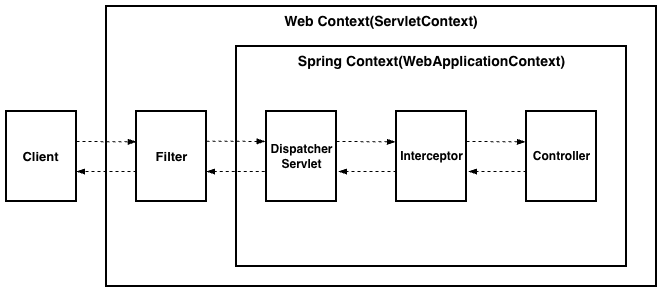

+++
title = "[Spring Boot] Filter로 Request Body 다시 읽기"
date = "2025-04-14"
draft = false
tags = ["Spring Boot", "Java"]
+++

#### Filter와 Interceptor가 필요했던 이유

API 요청을 받고 서비스 로직을 처리하기에 앞서 인증하는 과정이 필요했다. 컨트롤러마다 인증 로직을 넣어주는 것도 하나의 방법이지만, 공통적으로 처리할 수 있는 방법을 찾다가 **필터**(Filter)와 **인터셉터**(Interceptor)를 학습하게 되어 정리해본다.

#### Filter와 Interceptor의 차이



클라이언트에서 요청이 들어오면 가장 먼저 **필터**(Filter)를 만나게 된다. Dispatcher Servlet에 요청이 전달되기 전·후에 URL 패턴에 맞는 요청에 대한 공통 작업 처리가 가능한데, 스프링 컨테이너가 아닌 웹 컨테이너(예: Tomcat)에 의해 관리되기 때문에 Request와 Response 객체를 직접 조작할 수 있다. Spring Context 외부에 위치해서 Spring과는 무관하게 동작하며, 예외가 발생하면 웹 컨테이너 차원에서 처리된다.

**인터셉터**(Interceptor)는 Dispatcher Servlet 이후, 컨트롤러가 호출되기 전·후에 개입해서 요청과 응답을 처리한다. Spring Context 내부에 위치하기 때문에 Request와 Response 객체를 조작할 수는 없지만, 예외가 발생하면 `@ControllerAdvice`, `@ExceptionHandler` 같은 Spring의 예외 처리 방식을 사용할 수 있다.

컨트롤러 호출 전에 API 인증만 공통으로 처리하면 되는 것이었기 때문에, 인터셉터 기능을 먼저 적용해보기로 했다.

#### Interceptor 적용하기

`HandlerInterceptor` 인터페이스를 구현하는 `ApiInterceptor` 클래스부터 만들었다. 컨트롤러가 호출되기 전에 인증을 처리해야 하므로 `preHandle` 메서드를 사용했다.

```java
public class ApiInterceptor implements HandlerInterceptor {
    @Override
    public boolean preHandle(
            HttpServletRequest httpServletRequest,
            HttpServletResponse httpServletResponse,
            Object handler
    ) throws Exception {
        Map<String, Object> params = new TreeMap<>();

        // 쿼리 · 폼 파라미터 추출
        Enumeration<String> paramNames = httpServletRequest.getParameterNames();
        while (paramNames.hasMoreElements()) {
            String paramName = paramNames.nextElement();
            params.put(paramName, httpServletRequest.getParameter(paramName));
        }

        // Body 파라미터 추출 (Content-Type: application/json)
        String body = StreamUtils.copyToString(httpServletRequest.getInputStream(), StandardCharsets.UTF_8);

        if (StringUtils.hasText(body)) {
            JSONObject jsonObject = new JSONObject(body);
            Iterator<?> iterator = jsonObject.keys();

            while (iterator.hasNext()) {
                String key = String.valueOf(iterator.next());
                params.put(key, jsonObject.get(key));
            }
        }

        // API 인증
        checkApiAuthentication(params);

        return true;
    }
}
```

쿼리·폼 파라미터는 `getParameterNames()`로 순회하며 추출하면 되지만, Content-Type이 `application/json`인 요청은 Body에서 직접 읽어와야 했다. 그래서 `getInputStream()`으로 Body를 읽어 JSON으로 파싱한 뒤 같은 `params` Map에 담고, 마지막에 `checkApiAuthentication`으로 인증을 체크하도록 작성했다.

이제 인터셉터를 등록해야 사용할 수 있으므로, `WebMvcConfigurer` 인터페이스를 구현하는 `WebMvcConfig` 클래스를 만들었다. `ApiInterceptor`를 빈으로 등록한 뒤, `addInterceptors` 메서드로 인터셉터를 등록하고 적용할 URL 패턴을 지정했다.

```java
@Configuration
public class WebMvcConfig implements WebMvcConfigurer {
    @Bean
    public ApiInterceptor apiInterceptor() {
        return new ApiInterceptor();
    }

    @Override
    public void addInterceptors(InterceptorRegistry registry) {
        registry.addInterceptor(apiInterceptor())
                .addPathPatterns("/api/**");
    }
}
```

그런데 실행해보니 아래와 같은 오류가 발생했다.

```text
org.springframework.http.converter.HttpMessageNotReadableException: Required request body is missing
```

찾아보니 `httpServletRequest.getInputStream()`으로 Request Body를 한 번 읽고 나면, 그 이후에는 다시 읽을 수 없다는 것을 알게 되었다. 인터셉터에서 Body를 먼저 읽어버리는 바람에, 정작 컨트롤러에서 `@RequestBody`로 Body를 읽으려 할 때는 이미 스트림이 소진되어 위와 같은 오류가 발생한 것이었다.

> 쿼리·폼 파라미터는 여러 번 읽어도 문제가 되지 않는데, `getParameter`는 스프링 컨테이너가 아니라 웹 컨테이너가 요청이 들어오는 시점에 파라미터를 미리 파싱해서 메모리에 저장해두기 때문이다. 그래서 `getParameter`는 몇 번을 호출해도 항상 같은 값을 반환하지만, `getInputStream()`은 스트림을 직접 읽는 방식이라 한 번 소진되면 다시 채워지지 않는다.

검색을 통해 `HttpServletRequest`를 캐싱이 가능한 객체로 감싸서 사용하는 방법을 찾아냈다. 그런데 앞서 정리했듯 인터셉터는 Spring Context 내부에 위치해서 Request 객체를 조작할 수 없기 때문에, 이 캐싱은 인터셉터가 아니라 필터에서 처리해야 했다.

#### Filter 적용하기

`HttpServletRequestWrapper`는 Spring이 아니라 Jakarta Servlet API에 정의된 클래스다. 이 클래스를 상속받아, Body를 미리 읽어서 Byte 배열로 들고 있다가 `getInputStream()`이 호출될 때마다 그 배열로 새 스트림을 만들어 반환하는 `CachedContentHttpServletRequest` 클래스를 구현했다.

```java
public class CachedContentHttpServletRequest extends HttpServletRequestWrapper {
    private byte[] cachedContent = new byte[0];

    public CachedContentHttpServletRequest(HttpServletRequest request) throws IOException {
        super(request);

        String contentType = getContentType();
        if (StringUtils.hasText(contentType) && contentType.contains(MediaType.APPLICATION_JSON_VALUE)) {
            this.cachedContent = StreamUtils.copyToByteArray(request.getInputStream());
        }
    }

    @Override
    public ServletInputStream getInputStream() throws IOException {
        ByteArrayInputStream inputStream = new ByteArrayInputStream(this.cachedContent);
        return new ServletInputStream() {
            @Override
            public boolean isFinished() {
                return inputStream.available() == 0;
            }

            @Override
            public boolean isReady() {
                return true;
            }

            @Override
            public void setReadListener(ReadListener listener) {
                throw new UnsupportedOperationException();
            }

            @Override
            public int read() throws IOException {
                return inputStream.read();
            }
        };
    }

    @Override
    public BufferedReader getReader() throws IOException {
        return new BufferedReader(new InputStreamReader(new ByteArrayInputStream(this.cachedContent), getCharacterEncoding()));
    }
}
```

`Filter` 인터페이스를 구현하는 `ApiFilter` 클래스를 만들었다. `doFilter` 메서드에서 `HttpServletRequest`를 `CachedContentHttpServletRequest`로 감싼 뒤, 그 객체를 다음 체인으로 넘기도록 작성했다.

```java
public class ApiFilter implements Filter {
    @Override
    public void doFilter(
            ServletRequest servletRequest,
            ServletResponse servletResponse,
            FilterChain filterChain
    ) throws IOException, ServletException {
        CachedContentHttpServletRequest cachingRequest = new CachedContentHttpServletRequest((HttpServletRequest) servletRequest);
        filterChain.doFilter(cachingRequest, servletResponse);
    }
}
```

`filterChain.doFilter`에 원본 `servletRequest`가 아니라 `cachingRequest`를 넘겼기 때문에, 이후 체인에 있는 인터셉터와 컨트롤러는 모두 이 캐싱된 Request 객체를 사용하게 된다.

필터도 마찬가지로 등록해야 사용할 수 있으므로, `FilterConfig` 클래스를 만들어 `FilterRegistrationBean`으로 등록하고 적용할 URL 패턴을 지정했다.

```java
@Configuration
public class FilterConfig {
    @Bean
    public FilterRegistrationBean<Filter> apiFilter() {
        FilterRegistrationBean<Filter> filterRegistrationBean = new FilterRegistrationBean<>();
        filterRegistrationBean.setFilter(new ApiFilter());
        filterRegistrationBean.setOrder(1);
        filterRegistrationBean.addUrlPatterns("/api/*");
        return filterRegistrationBean;
    }
}
```

#### 동작 확인

Filter에서 감싼 Request 객체가 Interceptor와 Controller까지 그대로 전달되는지 확인하기 위해, 각 클래스에 `@Slf4j`를 추가하고 지점마다 로그를 하나씩 남겨봤다.

```java
// ApiFilter.doFilter
log.info("[Filter] request={}", cachingRequest);
```

```java
// ApiInterceptor.preHandle
log.info("[Interceptor] request={}", httpServletRequest);
```

```java
// Controller 메서드
log.info("[Controller] request={}", httpServletRequest);
```

테스트 요청을 보내보니 아래와 같은 로그가 찍혔다.

```text
[Filter] request=com.example.api.global.common.CachedContentHttpServletRequest@29f18050
[Interceptor] request=com.example.api.global.common.CachedContentHttpServletRequest@29f18050
[Controller] request=com.example.api.global.common.CachedContentHttpServletRequest@29f18050
```

세 지점에서 찍힌 해시코드(`@29f18050`)가 모두 같아서, Filter에서 캐싱한 Request 객체가 Interceptor와 Controller까지 그대로 이어져서 사용되고 있다는 것을 확인할 수 있었다. 그 결과 Request Body를 인터셉터에서도, 컨트롤러에서도 재사용할 수 있었고, 처음 겪었던 `Required request body is missing` 오류도 더 이상 발생하지 않았다.
