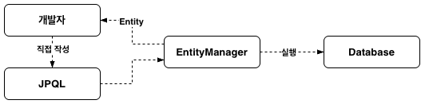
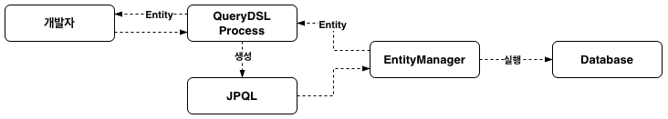

+++
title = "[Spring Boot] JPA 동적 쿼리와 QueryDSL"
date = "2025-06-15"
draft = false
tags = ["Spring Boot", "Java", "MySQL"]
+++

#### JPA 동적 쿼리를 작성하려면

JPA에서는 검색 조건처럼 조건에 따라 쿼리가 달라져야 하는 동적 쿼리를 작성해야 할 때가 있다. 이번 글에서는 JPQL과 QueryDSL의 동작 흐름을 비교해보고, QueryDSL을 어떻게 적용했는지 정리해보려고 한다.

#### JPQL



JPQL(Java Persistence Query Language)은 JPA의 동적 쿼리를 작성할 수 있는 방법 중 하나로, SQL과 비슷한 문법을 가진다. 개발자가 직접 JPQL 문법으로 쿼리를 작성하고, `EntityManager` 객체를 통해 쿼리를 생성해서 실행할 수 있다. 게시글을 조회하는 예시 코드로 살펴보면 다음과 같다.

```java
@Repository
@RequiredArgsConstructor
public class DocumentRepository {
    private final EntityManager entityManager;

    public List<DocumentEntity> loadDocuments(String userId, String title) {
        String jpqlQuery = "SELECT d FROM DOCUMENT d WHERE 1 = 1";

        if (StringUtils.hasText(userId)) {
            jpqlQuery += " AND d.userId = :userId";
        }

        if (StringUtils.hasText(title)) {
            jpqlQuery += " AND d.title LIKE CONCAT('%', :title, '%')";
        }

        TypedQuery<DocumentEntity> query = entityManager.createQuery(jpqlQuery, DocumentEntity.class);

        if (StringUtils.hasText(userId)) {
            query = query.setParameter("userId", userId);
        }

        if (StringUtils.hasText(title)) {
            query = query.setParameter("title", title);
        }

        return query.getResultList();
    }
}
```

이렇게 JPQL 문법으로 쿼리를 작성하고, 분기 처리를 통해 검색 조건을 추가할 수 있다. 하지만 코드에서 보이는 것처럼 JPQL에는 다음과 같은 문제가 있었다.

1. JPQL은 문자열로 작성하기 때문에, 해당 메서드가 실제로 호출되어 런타임에 도달해야만 문법 오류를 확인할 수 있다. 즉, 컴파일 시점에는 오류를 발견할 수 없어서 타입 안정성을 보장하지 못한다.
2. 분기 처리로 검색 조건을 추가해야 하기 때문에, 코드를 직관적으로 작성하기 어렵다.

이런 한계 때문에 JPA의 동적 쿼리를 작성할 수 있는 다른 방법을 찾아보게 되었고, QueryDSL을 써보게 되었다.

#### QueryDSL



QueryDSL은 SQL, JPQL 등을 코드로 작성할 수 있게 해주는 라이브러리다. JPA가 지원하는 표준 기술은 아니지만, 입력한 데이터를 바탕으로 JPQL을 대신 생성해주기 때문에 **컴파일 시점에 오류를 발견할 수 있어 타입 안정성이 보장된다.** 그리고 동적 쿼리도 훨씬 직관적으로 작성할 수 있다는 장점이 있다.

#### dependency 추가

```groovy
dependencies {
    implementation 'com.querydsl:querydsl-jpa:5.0.0:jakarta'
    annotationProcessor 'com.querydsl:querydsl-apt:5.0.0:jakarta'
    annotationProcessor 'jakarta.annotation:jakarta.annotation-api'
    annotationProcessor 'jakarta.persistence:jakarta.persistence-api'
}
```

Gradle 기준으로 위 의존성을 추가해준다.

> Spring Boot 3 버전부터는 `javax` 패키지 이름이 `jakarta`로 바뀌었기 때문에, 의존성에도 이를 반영해줘야 한다.

#### JPAQueryFactory 등록하기

```java
@Configuration
@RequiredArgsConstructor
public class QueryDslConfig {
    private final EntityManager entityManager;

    @Bean
    public JPAQueryFactory jpaQueryFactory() {
        return new JPAQueryFactory(entityManager);
    }
}
```

`JPAQueryFactory`는 QueryDSL에서 제공하는 객체로, JPA를 기반으로 동적 쿼리를 작성할 때 사용한다. `EntityManager` 객체를 기반으로 `JPAQueryFactory` 객체를 생성한다.

#### Q 클래스

```java
/**
 * QDocumentEntity is a Querydsl query type for DocumentEntity
 */
@Generated("com.querydsl.codegen.DefaultEntitySerializer")
public class QDocumentEntity extends EntityPathBase<DocumentEntity> {
    public final StringPath userId = createString("userId");
    public final StringPath title = createString("title");
    ...
}
```

QueryDSL은 쿼리 생성에 특화된 라이브러리로, `Q`라는 접두사가 붙은 클래스를 사용한다. 컴파일 시점에 `@Entity` 어노테이션을 선언한 클래스를 탐색해서 Q 클래스를 자동으로 생성하며, `build/generated` 경로를 찾아보면 생성된 Q 클래스를 확인할 수 있다. 쿼리를 작성할 때 이 클래스를 사용하기 때문에 타입 안정성이 보장된다.

#### 적용 예시

```java
import static com.example.entity.QDocumentEntity.documentEntity;

@Repository
@RequiredArgsConstructor
public class DocumentRepository {
    private final JPAQueryFactory jpaQueryFactory;

    public List<DocumentEntity> loadDocuments(String userId, String title) {
        return jpaQueryFactory
                .select(documentEntity)
                .from(documentEntity)
                .where(
                        documentEntity.userId.eq(userId),
                        documentEntity.title.contains(title)
                )
                .fetch();
    }
}
```

쿼리에 사용할 Q 클래스를 import하고, `jpaQueryFactory` 객체로 메서드 체이닝 방식으로 쿼리를 작성한다. 아직 동적으로 쿼리를 작성한 건 아니지만, 앞서 JPQL로 작성했던 예시보다 코드가 훨씬 직관적이라는 걸 알 수 있다. 적용하면서 도움이 될 만한 코드 몇 가지를 정리해본다.

#### WHERE 절 - BooleanBuilder와 BooleanExpression

WHERE 절에 다중 조건을 사용하는 방법에는 `BooleanBuilder`와 `BooleanExpression` 두 가지 방식이 있다.

```java
public List<DocumentEntity> loadDocuments(String userId, String title) {
    BooleanBuilder where = new BooleanBuilder();

    if (StringUtils.hasText(userId)) {
        where.and(documentEntity.userId.eq(userId));
    }

    if (StringUtils.hasText(title)) {
        where.and(documentEntity.title.contains(title));
    }

    return jpaQueryFactory
            .select(documentEntity)
            .from(documentEntity)
            .where(where)
            .fetch();
}
```

`BooleanBuilder` 객체를 만들고 분기 처리를 하면서 `and` 또는 `or` 메서드로 검색 조건을 추가한다. 하지만 JPQL과 마찬가지로 분기 처리 구문이 그대로 보이기 때문에, 코드를 직관적으로 파악하기 어렵다.

```java
public List<DocumentEntity> loadDocuments(String userId, String title) {
    return jpaQueryFactory
            .select(documentEntity)
            .from(documentEntity)
            .where(
                    userIdEq(userId),
                    titleContains(title)
            )
            .fetch();
}

// WHERE :: userId
private BooleanExpression userIdEq(String userId) {
    return StringUtils.hasText(userId) ? documentEntity.userId.eq(userId) : null;
}

// WHERE LIKE :: title
private BooleanExpression titleContains(String title) {
    return StringUtils.hasText(title) ? documentEntity.title.contains(title) : null;
}
```

`where` 메서드는 인자로 null 값이 들어오면 무시하기 때문에, `BooleanExpression`을 반환하는 검색 조건 메서드에서 검색 값이 없을 경우 null을 반환하도록 했다. 이렇게 바꾸니 분기 처리 구문 없이도 코드를 훨씬 직관적으로 이해할 수 있었다.

> **`like`와 `contains`**
>
> `like` 메서드는 `%`를 직접 명시해서 사용해야 한다. `contains` 메서드는 자동으로 문자열 앞뒤에 `%`가 붙는다.

#### ORDER BY 절 - OrderSpecifier

```java
public List<DocumentEntity> loadDocuments(String userId, String title) {
    return jpaQueryFactory
            .select(documentEntity)
            .from(documentEntity)
            .where(...)
            .orderBy(documentEntity.categoryId.desc(), documentEntity.id.desc())
            .fetch();
}
```

`orderBy` 메서드로 ORDER BY 절을 수행할 수 있는데, WHERE 절처럼 정렬 조건도 동적으로 전달될 수 있을 것 같았다. 그래서 정렬할 컬럼을 동적으로 지정할 수 있는 `OrderSpecifier` 객체를 사용해서 아래와 같은 코드를 만들어봤다.

```java
public class QueryDslUtils {
    /**
     * 동적 정렬에 대한 OrderSpecifier 배열 생성
     */
    public static <T> OrderSpecifier<?>[] createOrderSpecifierArr(
            EntityPathBase<T> entityPathBase,
            String[] orderByArr // 배열 타입으로 전달 ex) {"category_id DESC", "id DESC"}
    ) {
        // 정렬 조건이 없을 경우
        if (ObjectUtils.isEmpty(orderByArr)) {
            return null;
        }

        // orderByArr 배열 크기만큼 orderSpecifierArr 배열 크기 지정
        OrderSpecifier<?>[] orderSpecifierArr = new OrderSpecifier[orderByArr.length];
        // 엔티티 속성에 접근할 수 있도록 PathBuilder 객체 생성
        PathBuilder<T> pathBuilder = new PathBuilder<>(entityPathBase.getType(), entityPathBase.getMetadata().getName());

        for (int orderByArrIdx = 0; orderByArrIdx < orderByArr.length; ++orderByArrIdx) {
            // ex) "category_id DESC" -> {"category_id", "DESC"}
            String[] splitOrderByArr = orderByArr[orderByArrIdx].split(" ");
            // ex) "category_id" => {"category", "id"}
            String[] splitSnakeCaseValueArr = splitOrderByArr[0].split("_");
            // ==================== Snake Case -> Camel Case S ====================
            StringBuilder stringBuilder = new StringBuilder(splitSnakeCaseValueArr[0]);

            for (int splitSnakeCaseValueArrIdx = 1; splitSnakeCaseValueArrIdx < splitSnakeCaseValueArr.length; ++splitSnakeCaseValueArrIdx) {
                stringBuilder.append(splitSnakeCaseValueArr[splitSnakeCaseValueArrIdx].substring(0, 1).toUpperCase())
                        .append(splitSnakeCaseValueArr[splitSnakeCaseValueArrIdx].substring(1).toLowerCase());
            }
            // ==================== Snake Case -> Camel Case E ====================

            orderSpecifierArr[orderByArrIdx] = new OrderSpecifier<>(
                    "ASC".equals(splitOrderByArr[1]) ? Order.ASC : Order.DESC,
                    pathBuilder.getString(stringBuilder.toString())
            );
        }

        return orderSpecifierArr;
    }
}
```

다른 곳에서도 재사용할 수 있도록, 동적 정렬을 위한 코드를 QueryDSL 관련 유틸 클래스에 메서드로 만들어봤다.

정렬 조건은 여러 개일 수 있고, QueryDSL의 `orderBy` 메서드에는 `OrderSpecifier` 객체가 배열 타입으로 전달되어야 하기 때문에, 위처럼 `OrderSpecifier` 배열을 반환하는 메서드를 만들었다. 전달된 정렬 조건 배열(`orderByArr`)이 없으면 null을 반환하고, 있으면 다음 순서로 `OrderSpecifier` 객체를 만들어 배열에 담아 반환한다.

1. `orderByArr` 배열 크기만큼 `OrderSpecifier` 배열의 크기를 지정한다.
2. 전달된 엔티티 객체의 정보로 `PathBuilder` 객체를 생성한다.
3. `orderByArr` 배열 값 중 스네이크 표기법인 정렬 컬럼 값을 카멜 표기법으로 바꾼다. (ex. `"category_id"` → `{"category", "id"}` → `"category"` + `"Id"` → `"categoryId"`)
4. 정렬 순서 값과 변경된 정렬 컬럼 값으로 `OrderSpecifier` 객체를 생성한다.

```java
public List<DocumentEntity> loadDocuments(
        String userId,
        String title,
        String[] orderByArr
) {
    // QUERY
    JPAQuery<DocumentEntity> jpaQuery = jpaQueryFactory
            .select(documentEntity)
            .from(documentEntity)
            .where(...);

    // ORDER BY
    OrderSpecifier<?>[] orderSpecifierArr = QueryDslUtils.createOrderSpecifierArr(documentEntity, orderByArr);
    if (!ObjectUtils.isEmpty(orderSpecifierArr)) {
        jpaQuery.orderBy(orderSpecifierArr);
    }

    return jpaQuery.fetch();
}
```

QueryDSL의 `orderBy` 메서드는 null 값이 전달되면 오류가 발생하기 때문에, `createOrderSpecifierArr`가 null을 반환할 경우에는 `orderBy`를 아예 호출하지 않도록 분기 처리를 해줬다.

#### 실행된 쿼리 확인하기

```yaml
spring:
  jpa:
    properties:
      hibernate:
        format_sql: true
        highlight: true
```

설정 파일에서 Hibernate의 `format_sql`과 `highlight` 옵션을 켜두면, 실행된 쿼리를 출력할 때 가독성을 높일 수 있다.

`format_sql`을 켜기 전에는 쿼리가 한 줄로 출력된다.

```sql
select de1_0.id, de1_0.category_id, de1_0.title, de1_0.content, de1_0.user_id, de1_0.created_at from DOCUMENT de1_0 where de1_0.user_id=? order by de1_0.category_id desc, de1_0.id desc
```

`format_sql`을 켜면 절 단위로 줄바꿈되어 훨씬 읽기 편해진다.

```sql
select
    de1_0.id,
    de1_0.category_id,
    de1_0.title,
    de1_0.content,
    de1_0.user_id,
    de1_0.created_at
from
    DOCUMENT de1_0
where
    de1_0.user_id=?
order by
    de1_0.category_id desc,
    de1_0.id desc
```

여기에 `highlight`까지 켜면 콘솔에 출력되는 쿼리의 키워드(`select`, `from`, `where`, `order by` 등)가 색으로 구분되어 훨씬 눈에 잘 들어온다.

쿼리를 SQL로 직접 작성하지 않고 메서드 체이닝으로 구현하다 보니, 실제로 어떤 쿼리가 나가는지 눈으로 확인하지 않으면 놓치기 쉽다. 그래서 이렇게 출력해보고 의도한 쿼리가 맞는지, 잘못된 매핑은 없는지, 최적화가 필요한 부분은 없는지 확인하는 과정이 중요하다.