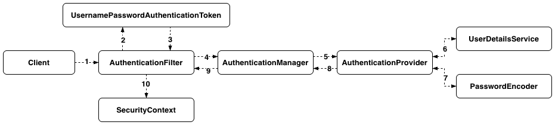
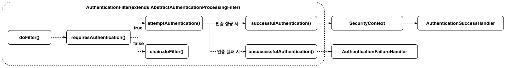

+++
title = "[Spring Boot] Spring Security 인증 흐름 이해하기"
date = "2025-10-07"
draft = false
tags = ["Spring Boot", "Java"]
+++

#### Spring Security를 적용해보게 된 계기

Spring Boot 프레임워크를 사용하면서 인증 처리라고 하면 Filter나 Interceptor 정도만 알고 있었다. 그러다가 접근하는 대상의 인증 또는 인가를 처리할 때는 Spring Security를 많이 사용한다는 걸 알게 되었고, 적용해보고 싶었다. 처음에는 Filter, Manager, Provider 같은 것들이 어떻게 동작하는지 전혀 몰랐는데, 로그인 인증을 직접 구현해보면서 어떤 흐름으로 인증과 인가가 처리되는지 알게 되었다. 이번 글에서는 그 흐름을 정리해보려고 한다.



위 그림의 순서대로, 요청이 `AuthenticationFilter`에 도착한 뒤 `AuthenticationManager`와 `AuthenticationProvider`를 거쳐 `SecurityContext`에 저장되기까지의 흐름을 하나씩 살펴보겠다.

#### AuthenticationFilter

사용자가 로그인 폼에 ID/PW를 입력해서 요청을 보내면(1), Spring Security는 이 요청을 `AuthenticationFilter`로 가로챈다. `AuthenticationFilter`는 직접 인증 로직을 수행하지 않고, 요청에서 인증에 필요한 정보를 꺼내 아직 검증되지 않은 `Authentication` 객체를 만든 뒤 `AuthenticationManager`에게 넘기는 역할만 한다.

Spring Security는 ID/PW 로그인을 위한 `AuthenticationFilter`를 기본으로 제공하는데, 이게 `UsernamePasswordAuthenticationFilter`다. 이 필터는 직접 구현할 필요는 없지만, 내부적으로 대략 이런 일을 한다.

```java
public Authentication attemptAuthentication(HttpServletRequest request, HttpServletResponse response) {
    String username = obtainUsername(request);
    String password = obtainPassword(request);

    UsernamePasswordAuthenticationToken authRequest =
            UsernamePasswordAuthenticationToken.unauthenticated(username, password);

    return this.getAuthenticationManager().authenticate(authRequest);
}
```

요청에서 ID(`username`)와 PW(`password`)를 꺼내서 `UsernamePasswordAuthenticationToken`을 만들고(2, 3), 이걸 그대로 `AuthenticationManager.authenticate()`에 넘긴다(4).

`UsernamePasswordAuthenticationToken`의 생김새를 간단히 보면 다음과 같다.

```java
public class UsernamePasswordAuthenticationToken extends AbstractAuthenticationToken {
    private final Object principal;
    private Object credentials;

    public UsernamePasswordAuthenticationToken(Object principal, Object credentials) {
        super(null);
        this.principal = principal;
        this.credentials = credentials;
        setAuthenticated(false);
    }
}
```

`AbstractAuthenticationToken`을 상속해서 `Authentication` 인터페이스를 구현한 객체이며, `principal`은 인증 대상(ID), `credentials`는 그 대상을 증명할 값(PW)을 의미한다. 이 생성자로 만든 객체는 `setAuthenticated(false)`가 호출되어 있어서, 아직 검증되지 않은 상태 그대로 `AuthenticationManager`에게 전달된다.

> **다른 인증 방식이 필요하다면**
>
> 지금은 ID/PW 로그인만 다루고 있어서 기본 제공되는 `UsernamePasswordAuthenticationFilter`를 그대로 썼지만, 2단계 인증처럼 다른 인증 방식이 추가로 필요하다면 `AbstractAuthenticationProcessingFilter`를 상속받은 커스텀 필터를 직접 만들 수도 있다. 이 경우 `attemptAuthentication()`을 오버라이드해서, 그 방식에 맞는 새로운 `Authentication` 구현체를 만들어 넘기면 된다.

#### AuthenticationManager

`AuthenticationFilter`로부터 미인증 토큰을 넘겨받은 `AuthenticationManager`는, 직접 인증 로직을 수행하지 않고 이 토큰을 처리할 수 있는 `AuthenticationProvider`를 찾아서 위임하는 역할을 한다(4 → 5).

`AuthenticationManager`는 인터페이스이고, Spring Security가 기본으로 제공하는 구현체는 `ProviderManager`다. `ProviderManager`는 여러 개의 `AuthenticationProvider`를 리스트로 갖고 있다가, 넘어온 `Authentication` 객체의 타입을 각 Provider에게 물어봐서, 그 타입을 지원하는 Provider에게 실제 인증을 위임한다. 이걸 판단하는 게 각 `AuthenticationProvider`가 구현하는 `supports()` 메소드다.

```java
@Override
public boolean supports(Class<?> authentication) {
    return UsernamePasswordAuthenticationToken.class.isAssignableFrom(authentication);
}
```

`ProviderManager`는 등록된 Provider들을 순서대로 훑으면서 이 `supports()`를 호출해, 지금 넘어온 `Authentication` 객체의 타입을 처리할 수 있는 Provider를 찾는다. `true`를 반환하는 Provider를 찾으면 그 Provider의 `authenticate()`를 호출해서 실제 인증을 위임하고, 나머지 Provider는 건너뛴다. 즉 Provider가 여러 개 등록되어 있어도, 토큰 타입에 맞는 Provider 하나만 실제로 실행된다.

```java
@Bean
public AuthenticationManager authenticationManager(
        UsernamePasswordAuthenticationProvider usernamePasswordAuthenticationProvider,
        OtpAuthenticationProvider otpAuthenticationProvider
) {
    return new ProviderManager(
            usernamePasswordAuthenticationProvider,
            otpAuthenticationProvider
    );
}
```

로그인 방식이 여러 개(ID/PW, OTP 등)라면 이렇게 각 방식에 맞는 `AuthenticationProvider`를 여러 개 만들어서 `ProviderManager`에 함께 등록해두면, 어떤 방식으로 로그인 요청이 들어오든 `supports()`를 통해 알맞은 Provider가 자동으로 선택된다.

#### AuthenticationProvider

`AuthenticationManager`로부터 위임받은 `AuthenticationProvider`가 실제 인증 로직을 수행한다(5). Spring Security가 기본으로 제공하는 구현체는 `DaoAuthenticationProvider`인데, 이건 `UserDetailsService`와 `PasswordEncoder`를 이용해서 검증한다.

```java
public Authentication authenticate(Authentication authentication) {
    String username = authentication.getName();
    String password = (String) authentication.getCredentials();

    UserDetails userDetails = userDetailsService.loadUserByUsername(username); // (6)

    if (!passwordEncoder.matches(password, userDetails.getPassword())) { // (7)
        throw new BadCredentialsException("Bad credentials");
    }

    return new UsernamePasswordAuthenticationToken(
            userDetails,
            null,
            userDetails.getAuthorities()
    );
}
```

`userDetailsService.loadUserByUsername(username)`은 파라미터로 `username`만 받는다(6). 사용자가 입력한 비밀번호는 여기서 다루지 않고, 저장되어 있는 사용자 정보(`UserDetails`, 암호화된 비밀번호 포함)를 조회해오는 역할만 한다.

그 다음 `passwordEncoder.matches(입력한 비밀번호, UserDetails에 담긴 암호화된 비밀번호)`로 실제 비교가 이루어진다(7). 일치하지 않으면 `BadCredentialsException`을 던져서 인증에 실패한다.

비교에 성공하면, 앞서 넘어왔던 미인증 토큰을 재사용하는 게 아니라 `UsernamePasswordAuthenticationToken`을 새롭게 만들어서 반환한다(8). 이 생성자는 내부적으로 `authenticated`를 자동으로 `true`로 설정한다.

#### AuthenticationFilter의 인증 결과 처리

`AuthenticationProvider`가 반환한 인증된 `Authentication`은 `AuthenticationManager`를 거쳐 그대로 `AuthenticationFilter`로 리턴된다(9). Provider와 Manager는 성공/실패를 판단해서 값을 리턴하거나 예외를 던질 뿐이고, 그 결과를 받아서 최종 처리를 하는 건 다시 Filter다. 여기서 일어나는 일을 정리하면 다음과 같다.



클라이언트의 요청이 들어오면 `AbstractAuthenticationProcessingFilter`를 상속받은 `AuthenticationFilter`의 `doFilter()`가 동작한다. 이때 요청 경로가 `loginProcessingUrl`(또는 필터 클래스에 지정된 처리 경로)과 일치하면 `requiresAuthentication()`이 `true`를 반환하면서 인증이 시작되고, `attemptAuthentication()`이 호출된다. 일치하지 않으면 `chain.doFilter()`로 다음 필터에게 넘어간다.

이렇게 시작된 인증이 성공적으로 끝나면 `successfulAuthentication()` 쪽으로, 인증에 실패했거나 예외가 발생하면 `unsuccessfulAuthentication()` 쪽으로 빠진다.

```java
protected void successfulAuthentication(
        HttpServletRequest request,
        HttpServletResponse response,
        FilterChain chain,
        Authentication authResult
) throws IOException, ServletException {
    SecurityContext context = SecurityContextHolder.createEmptyContext();
    context.setAuthentication(authResult);
    SecurityContextHolder.setContext(context);
    securityContextRepository.saveContext(context, request, response); // (10)

    getSuccessHandler().onAuthenticationSuccess(request, response, authResult);
}

protected void unsuccessfulAuthentication(
        HttpServletRequest request,
        HttpServletResponse response,
        AuthenticationException failed
) throws IOException, ServletException {
    SecurityContextHolder.clearContext();
    getFailureHandler().onAuthenticationFailure(request, response, failed);
}
```

`attemptAuthentication()`이 정상적으로 `Authentication`을 반환하면 `successfulAuthentication()`이 호출된다. 여기서 인증된 `Authentication`을 `SecurityContext`에 담아 `SecurityContextHolder`에 저장하는데, 이건 지금 요청을 처리하는 동안만 바로 꺼내 쓸 수 있는 임시 저장소다. 그래서 다음 요청에서도 이 사용자를 계속 인증된 상태로 인식시키려면 별도로 저장해둬야 하는데, 이 역할을 `SecurityContextRepository`가 한다 — 세션 같은 곳에 `SecurityContext`를 저장해둬서, 다음 요청부터도 다시 꺼내 쓸 수 있게 만든다(10). 저장이 끝나면 `AuthenticationSuccessHandler`가 호출된다.

반대로 `attemptAuthentication()`이 `AuthenticationException`(`BadCredentialsException` 등)을 던지면 `unsuccessfulAuthentication()`이 호출되고, `AuthenticationFailureHandler`가 실행된다.

> **인증(Authentication)과 인가(Authorization)**
>
> 인증은 "이 사용자가 누구인지"를 확인하는 과정이고, 인가는 인증된 사용자가 "이 리소스에 접근할 권한이 있는지"를 확인하는 과정이다. 지금까지 살펴본 로그인 흐름(Filter → Manager → Provider → SecurityContext)은 전부 인증에 해당한다. 인증에 성공해서 `SecurityContext`에 저장이 끝나면, 이후 요청마다 이 정보를 바탕으로 `authorizeHttpRequests` 규칙에 따라 인가가 별도로 처리된다.

#### SecurityFilterChain으로 인가 처리하기

인증이 끝났다고 해서 모든 요청이 허용되는 건 아니다. 인증된 사용자라도 권한이 없는 리소스에는 접근하지 못하도록 막아야 하는데, 이걸 설정하는 게 `SecurityFilterChain`의 `authorizeHttpRequests`다.

```java
@Bean
public SecurityFilterChain securityFilterChain(HttpSecurity http) throws Exception {
    http
            .securityMatcher("/admin/**")
            .authorizeHttpRequests(auth -> auth
                    .requestMatchers("/admin/login").permitAll()
                    .requestMatchers("/admin/**").hasRole("ADMIN")
                    .anyRequest().authenticated()
            )
            .exceptionHandling(ex -> ex
                    .accessDeniedHandler(accessDeniedHandler)
            )
            .formLogin(login -> login
                    .loginPage("/admin/login")
                    .loginProcessingUrl("/admin/login")
            );

    return http.build();
}
```

`requestMatchers(...)`로 경로별 접근 조건을 지정하는데, `/admin/login`은 로그인 페이지 자체이므로 `permitAll()`로 열어두고, `/admin/**`은 `ADMIN` 권한이 있어야 접근할 수 있도록 `hasRole("ADMIN")`로 제한했다. 여기 걸리지 않는 나머지 요청은 `authenticated()`로 "로그인만 되어 있으면" 접근을 허용한다.

`securityMatcher(...)`와 `requestMatchers(...)`도 둘 다 경로를 지정한다는 점은 같지만, 적용되는 범위가 다르다. `securityMatcher(...)`는 애플리케이션에 여러 `SecurityFilterChain`이 등록되어 있을 때, 지금 들어온 요청에 이 체인 전체를 적용할지 결정한다. 예를 들어 `/admin/**`이 아닌 요청은 이 체인 자체를 타지 않고 다른 체인으로 넘어간다. 반면 `requestMatchers(...)`는 이미 이 체인을 타기로 정해진 뒤, 그 안에서 경로별로 어떤 접근 조건을 적용할지 결정한다.

> **hasRole()과 ROLE\_ 접두사, 그리고 RoleHierarchy**
>
> 앞서 `AuthenticationProvider`에서 `UsernamePasswordAuthenticationToken`을 만들 때 세 번째 인자로 넘겼던 `userDetails.getAuthorities()`가 바로 이 권한 정보(`GrantedAuthority`)다. Spring Security는 역할(Role) 기반 권한에 `ROLE_` 접두사를 붙이는 걸 관례로 삼고 있어서, 실제 `GrantedAuthority` 값은 `ROLE_ADMIN`처럼 저장된다. 그런데 `hasRole("ADMIN")`처럼 쓸 때는 접두사 없이 `ADMIN`만 적는데, `hasRole()`이 내부적으로 `ROLE_`을 자동으로 붙여서 비교해주기 때문이다. 반면 `hasAuthority("ROLE_ADMIN")`을 쓴다면 접두사까지 그대로 적어야 한다.
>
> 역할 사이에 상하 관계가 있다면 `RoleHierarchy`로 정의해둘 수도 있다. 예를 들어 `ADMIN`이 `MANAGER`와 `USER`의 권한을 모두 포함해야 한다면, 매번 `hasAnyRole("ADMIN", "MANAGER", "USER")`처럼 나열하는 대신 아래처럼 계층을 한 번만 정의해두면 `hasRole("MANAGER")`로 제한된 경로에도 `ADMIN` 권한을 가진 사용자가 접근할 수 있다.
>
> ```java
> @Bean
> public RoleHierarchy roleHierarchy() {
>     return RoleHierarchyImpl.fromHierarchy("ROLE_ADMIN > ROLE_MANAGER\nROLE_MANAGER > ROLE_USER");
> }
> ```

이렇게 등록해둔 `authorizeHttpRequests` 규칙은 매 요청마다 `AuthorizationFilter`가 확인한다. `SecurityContext`에 저장된 `Authentication`을 확인하여 권한이 부족한 경우, 접근이 막히면서 `exceptionHandling(...).accessDeniedHandler(...)`로 등록해둔 `AccessDeniedHandler`가 실행되어 접근 불가 상황을 처리한다.