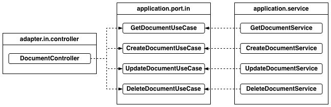
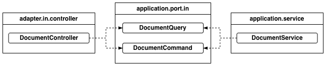
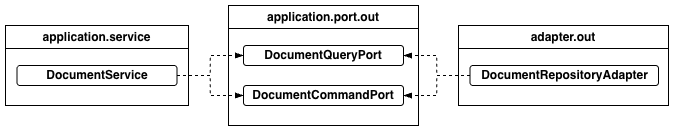

+++
title = "[Spring Boot] 포트(Port) 인터페이스 분리하기"
date = "2025-06-03"
draft = false
tags = ["Spring Boot", "Java", "Hexagonal Architecture"]
+++

#### 포트 인터페이스를 분리하게 된 이유


헥사고날 아키텍처에서 포트(Port) 인터페이스는 외부 영역(컨트롤러, 데이터베이스 등)과 내부 영역(핵심 비즈니스 로직)을 연결하는 중요한 역할을 한다. 그래서 게시글 관련 기능을 예시로 들어, 포트 인터페이스를 어떻게 분리할지 고민했던 과정을 정리해보려고 한다.

#### 유스케이스(Use Case) 기준 분리

> **유스케이스(Use Case)**
>
> 사용자가 해당 서비스를 통해 하고자 하는 것(사용자에게 제공하는 서비스)을 의미한다.

예를 들어 게시글 관련 서비스에서는 다음과 같은 유스케이스를 생각해볼 수 있는데, 각각을 독립된 인터페이스와 구현체 클래스로 나눠봤다.

- 사용자가 게시글을 조회한다.
- 사용자가 게시글을 등록한다.
- 사용자가 게시글을 수정한다.
- 사용자가 게시글을 삭제한다.

```markdown
├── adapter
│   └── in
│       └── controller
│           └── DocumentController.java
└── application
    ├── port
    │   └── in
    │       ├── GetDocumentUseCase.java
    │       ├── CreateDocumentUseCase.java
    │       ├── UpdateDocumentUseCase.java
    │       └── DeleteDocumentUseCase.java
    └── service
        ├── GetDocumentService.java
        ├── CreateDocumentService.java
        ├── UpdateDocumentService.java
        └── DeleteDocumentService.java
```

```java
public interface GetDocumentUseCase {
    DocumentResponse getDocument(DocumentRequestModel documentRequestModel);
}

public interface CreateDocumentUseCase {
    CreateDocumentResponse createDocument(CreateDocumentRequestModel createDocumentRequestModel);
}

public interface UpdateDocumentUseCase {
    UpdateDocumentResponse updateDocument(UpdateDocumentRequestModel updateDocumentRequestModel);
}

public interface DeleteDocumentUseCase {
    DeleteDocumentResponse deleteDocument(DeleteDocumentRequestModel deleteDocumentRequestModel);
}
```

```java
@Service
public class GetDocumentService implements GetDocumentUseCase {
    @Override
    public DocumentResponse getDocument(DocumentRequestModel documentRequestModel) {}
}

@Service
public class CreateDocumentService implements CreateDocumentUseCase {
    @Override
    public CreateDocumentResponse createDocument(CreateDocumentRequestModel createDocumentRequestModel) {}
}

@Service
public class UpdateDocumentService implements UpdateDocumentUseCase {
    @Override
    public UpdateDocumentResponse updateDocument(UpdateDocumentRequestModel updateDocumentRequestModel) {}
}

@Service
public class DeleteDocumentService implements DeleteDocumentUseCase {
    @Override
    public DeleteDocumentResponse deleteDocument(DeleteDocumentRequestModel deleteDocumentRequestModel) {}
}
```



각각의 인터페이스와 구현체 클래스가 하나의 유스케이스에만 집중하기 때문에 단일 책임 원칙(SRP)을 지킬 수 있고, 테스트도 훨씬 수월했다. 변경이 필요할 때도 해당 유스케이스의 인터페이스와 구현체만 고치면 되고, 구조만 보고도 어떤 로직이 어디 있는지 쉽게 파악할 수 있다는 장점이 있었다.

> **SRP(Single Responsibility Principle, 단일 책임 원칙)**
>
> 하나의 객체는 반드시 하나의 동작만의 책임을 갖는다는 원칙이다. 특정 객체에 책임이 과중되는 것을 지양하기 위한 원칙이다.

하지만 서비스가 확장될수록 유스케이스별로 인터페이스와 구현체 클래스가 늘어나기 때문에 파일 수가 많아져서 관리가 어려워지고, 비슷한 유스케이스 사이에 공통 로직이 있으면 코드가 중복될 수 있다는 문제를 알게 되었다. 그래서 서비스의 규모를 고려해서 다른 방식으로 인터페이스를 분리해보기로 했다.

#### 조회(Query)·명령(Command) 기준 분리

```markdown
├── adapter
│   └── in
│       └── controller
│           └── DocumentController.java
└── application
    ├── port
    │   └── in
    │       ├── DocumentQuery.java
    │       └── DocumentCommand.java
    └── service
        └── DocumentService.java
```

```java
public interface DocumentQuery {
    DocumentResponse getDocument(DocumentRequestModel documentRequestModel);
}

public interface DocumentCommand {
    CreateDocumentResponse createDocument(CreateDocumentRequestModel createDocumentRequestModel);
    UpdateDocumentResponse updateDocument(UpdateDocumentRequestModel updateDocumentRequestModel);
    DeleteDocumentResponse deleteDocument(DeleteDocumentRequestModel deleteDocumentRequestModel);
}
```

```java
@Service
public class DocumentService implements DocumentQuery, DocumentCommand {
    @Override
    public DocumentResponse getDocument(DocumentRequestModel documentRequestModel) {}

    @Override
    public CreateDocumentResponse createDocument(CreateDocumentRequestModel createDocumentRequestModel) {}

    @Override
    public UpdateDocumentResponse updateDocument(UpdateDocumentRequestModel updateDocumentRequestModel) {}

    @Override
    public DeleteDocumentResponse deleteDocument(DeleteDocumentRequestModel deleteDocumentRequestModel) {}
}
```

| 구분 | 조회(Query) | 명령(Command) |
|------|------|------|
| 설명 | 데이터를 조회하고 결과를 반환하는 작업 처리 | 데이터의 상태를 변경하는 작업 처리 |
| 예시 | 게시글을 조회한다. | 게시글을 등록한다. / 게시글을 수정한다. / 게시글을 삭제한다. |



어댑터(컨트롤러)에서 서비스로 들어오는 인바운드 포트 인터페이스에는 접미사로 `Query`·`Command`를 사용해서, 이름만 보고도 역할을 구분할 수 있도록 했다. 조회(`Query`) 인터페이스는 데이터의 가공과 반환에 집중하고, 명령(`Command`) 인터페이스는 데이터의 상태 변경과 관련된 로직에 집중한다.



서비스에서 외부 어댑터로 나가는 아웃바운드 포트 인터페이스에는 접미사로 `QueryPort`·`CommandPort`를 사용해서, 같은 방식으로 역할을 구분했다.

```java
public interface DocumentQueryPort {
    Document loadDocument(int id);
}

public interface DocumentCommandPort {
    Document insertDocument(Document document);
    Document updateDocument(Document document);
    void deleteDocument(int id);
}
```

인바운드 포트와 마찬가지로, 조회만 필요한 어댑터는 `DocumentQueryPort`만 구현하면 되고 상태를 변경하는 어댑터는 `DocumentCommandPort`만 구현하면 된다. 조회 또는 명령만 수행하는 서비스·어댑터에는 그에 맞는 인터페이스만 제공되기 때문에, 인터페이스 분리 원칙(ISP)도 함께 지킬 수 있다.

> **ISP(Interface Segregation Principle, 인터페이스 분리 원칙)**
>
> 클라이언트가 자신이 이용하지 않는 메서드에 의존하지 않아야 한다는 원칙이다. 인터페이스를 분리해서 클라이언트의 목적과 용도에 맞는 인터페이스를 제공해야 한다는 것이다.